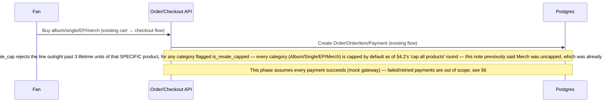
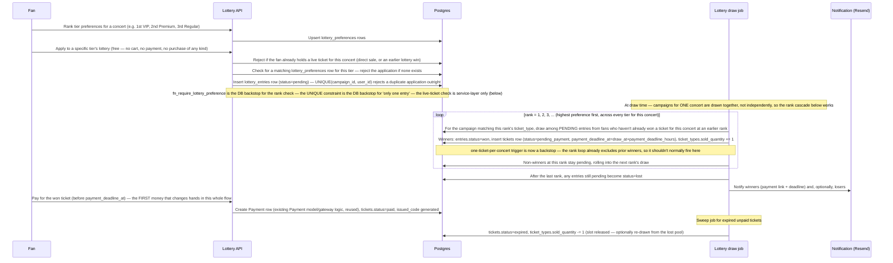

# Database Design — Idol Concert Ticket Reservation + Album/Singles Marketplace

Companion to `../CLAUDE.md` and `architecture.md`/`project_status.md`. `schema.sql` is cited
throughout as the reference DDL but doesn't exist as a file in the repo — treat every citation as
pointing at DDL that still needs to be extracted from the live migrations (see
`project_status.md`). Two editable draw.io exports live at the repo root: `idol-ticket-erd.drawio`
(the §2 ER diagram, all 28 tables) and `lottery-business-logic.drawio` (the §5 business-logic
flowchart) — open either in [diagrams.net](https://app.diagrams.net) or the desktop app to edit.

**Source draft (as given):**
- Three user kinds: admin, company manager, end user (fan who buys albums and tickets).
- An idol and a group each belong to exactly one managing company.
- An idol has: date of birth, hometown, talent, short intro, long description, and a position in
  the group (guitarist / vocal / dancer / visual / etc).
- Concerts/events happen at a venue that the managing company books.
- Seat tickets come in VIP, Premium, and Regular tiers.
- Main business logic: buy an album → get a lottery shot → random algorithm draws → winner gets
  a slot to buy a ticket → user is notified → user pays.
- Manager/admin can CRUD idols, groups, events, albums/singles. Admin has all rights. Fans can
  only view events/idol info and buy goods and tickets.

**Superseded:** the "buy an album → get a lottery shot" link above was the original mechanic, but
a later scope change (§3.13, §5) deliberately removed it — buying something and applying to a
lottery are now two fully independent flows. Kept the original bullet above as the historical
record of the initial draft; don't build against it directly, read §5 instead.

**Design choice confirmed with the user:** ticket tiers are **capacity-based, not seat-mapped** —
a tier (VIP/Premium/Regular) has a total quantity per concert, not individual numbered seats.
This keeps the schema to one `ticket_types` row per tier per concert rather than a
venue → section → seat hierarchy, while still fully supporting pricing, lottery, and checkout.

**Design choice confirmed with the user:** every table's primary key (and every foreign key) is a
`uuid` (Postgres native `uuid` type, `gen_random_uuid()`/app-side `uuid4()` default), not a
sequential integer — sequential ids let anyone enumerate resources
(`/products/search/2`, `/products/search/3`, ...) to scrape a table or probe for ids that
shouldn't be guessable (another user's cart, order, or ticket). This is a schema-wide,
retrofitted change (every `int`/`INTEGER` id below should be read as `uuid`); it isn't re-drawn
per table throughout this doc.

## 1. Entity overview

Four clusters, three of them new:

1. **Identity** (extends the existing `users` table) — role-based access: `admin`, `manager`,
   `fan`.
2. **Talent** (new) — `management_companies`, `groups`, `idols`, an `idol_colors` lookup (each
   idol's signature/member color), and a `positions` lookup + `idol_positions` join (an idol can
   hold more than one position, e.g. "main vocalist and lead dancer" — modeled as a table, not a
   fixed enum, because this list will keep growing).
3. **Events & ticketing** (new) — `venues` (capacity-derived `size` tier), `concerts` (its own
   `capacity`), `concert_performers` (which idols/groups play a concert), `ticket_types` (the
   VIP/Premium/Regular tiers per concert), `lottery_preferences` (a fan's ranked tier choices for
   a concert), `lottery_campaigns`, `lottery_entries`, `tickets`.
4. **Marketplace** (extends the existing `products`/`categories`/`cart`/`orders`/`payment`/
   `shipping_*` tables) — `categories` is now the single source of truth for "what kind of
   product is this" (seeded with Album/Single/EP/Merch — **4 categories, not 5**: "Lightstick"
   was merged into "Merch", see §3.17's "merged this round" note), and two new 1:1 detail
   tables hang off `products`: `album_details` (covers albums, singles, AND EPs uniformly —
   see §3.16) and `merch_details` (new this round, covers lightsticks and any other officially
   branded merch tied to one idol or one group). `genres`/`album_genres` do
   many-to-many genre tagging for every `album_details` row regardless of category, so the
   existing cart/checkout/payment/shipping machinery keeps working for albums, singles, EPs,
   and merch exactly as it does today for generic products. **Only fans can use
   any of it** — see §4.1.

## 2. ERD

```mermaid
erDiagram
    USERS ||--o{ IDOLS : "manages (via company)"
    USERS {
        uuid id PK
        string name
        string email
        user_role_enum role
        uuid company_id FK "nullable, set for role=manager"
    }

    MANAGEMENT_COMPANIES ||--o{ GROUPS : owns
    MANAGEMENT_COMPANIES ||--o{ IDOLS : owns
    MANAGEMENT_COMPANIES ||--o{ CONCERTS : organizes
    MANAGEMENT_COMPANIES ||--o{ USERS : employs

    GROUPS ||--o{ IDOLS : "has members (optional)"
    GROUPS {
        uuid id PK
        uuid company_id FK
        string name
        date debut_date
        string description
    }

    IDOLS {
        uuid id PK
        uuid company_id FK
        uuid group_id FK "nullable — solo idols allowed"
        string name
        date date_of_birth
        string hometown
        uuid color_id FK "nullable — member/signature color"
        string short_intro
        string long_description
    }

    IDOL_COLORS ||--o{ IDOLS : "signature color"
    IDOL_COLORS {
        uuid id PK
        string name
        string hex_code
    }

    POSITIONS ||--o{ IDOL_POSITIONS : ""
    IDOLS ||--o{ IDOL_POSITIONS : ""
    IDOL_POSITIONS {
        uuid idol_id FK
        uuid position_id FK
        bool is_primary
    }

    VENUES ||--o{ CONCERTS : hosts
    VENUES {
        uuid id PK
        string name
        string city
        int total_capacity
        venue_size_enum size "generated from total_capacity"
    }
    CONCERTS ||--o{ CONCERT_PERFORMERS : features
    IDOLS ||--o{ CONCERT_PERFORMERS : performs
    GROUPS ||--o{ CONCERT_PERFORMERS : performs
    CONCERTS {
        uuid id PK
        uuid company_id FK
        uuid venue_id FK
        string title
        int capacity "this event's capacity, may be <= venue.total_capacity"
        timestamp event_datetime
        concert_status_enum status
    }

    CONCERTS ||--o{ TICKET_TYPES : offers
    TICKET_TYPES {
        uuid id PK
        uuid concert_id FK
        ticket_tier_enum tier "vip / premium / regular"
        numeric price
        int total_quantity
        int sold_quantity
        sale_method_enum sale_method "lottery / direct"
    }

    CONCERTS ||--o{ LOTTERY_PREFERENCES : "ranked by"
    USERS ||--o{ LOTTERY_PREFERENCES : ranks
    TICKET_TYPES ||--o{ LOTTERY_PREFERENCES : "ranked as a choice"
    LOTTERY_PREFERENCES {
        uuid concert_id FK
        uuid user_id FK
        uuid ticket_type_id FK
        smallint rank "1 = first choice"
    }

    TICKET_TYPES ||--o{ LOTTERY_CAMPAIGNS : "runs a lottery for"
    LOTTERY_CAMPAIGNS ||--o{ LOTTERY_ENTRIES : collects
    USERS ||--o{ LOTTERY_ENTRIES : "applies directly (free, no purchase)"
    LOTTERY_ENTRIES {
        uuid campaign_id FK
        uuid user_id FK
        lottery_entry_status_enum status
    }

    LOTTERY_ENTRIES ||--o| TICKETS : "wins →"
    TICKET_TYPES ||--o{ TICKETS : issues
    USERS ||--o{ TICKETS : owns
    PAYMENT ||--o| TICKETS : settles

    CATEGORIES ||--o{ PRODUCTS : classifies
    CATEGORIES {
        uuid id PK
        string name UQ "Album / Single / EP / Merch"
        bool is_resale_capped "drives the anti-resale trigger, §4.2"
    }

    PRODUCTS ||--o| ALBUM_DETAILS : describes
    IDOLS ||--o{ ALBUM_DETAILS : "credited artist (nullable)"
    GROUPS ||--o{ ALBUM_DETAILS : "credited artist (nullable)"
    ALBUM_DETAILS {
        uuid product_id PK_FK
        uuid idol_id FK "nullable"
        uuid group_id FK "nullable"
        date release_date
        int track_count
        release_format_enum format "physical / digital"
    }
    ALBUM_DETAILS ||--o{ ALBUM_GENRES : ""
    GENRES ||--o{ ALBUM_GENRES : ""
    ALBUM_GENRES {
        uuid product_id FK
        uuid genre_id FK
    }
    GENRES {
        uuid id PK
        string name
    }

    PRODUCTS ||--o| MERCH_DETAILS : describes
    IDOLS ||--o{ MERCH_DETAILS : "owner (XOR with group)"
    GROUPS ||--o{ MERCH_DETAILS : "owner (XOR with idol)"
    IDOL_COLORS ||--o{ MERCH_DETAILS : "shell/light color (nullable)"
    MERCH_DETAILS {
        uuid product_id PK_FK
        uuid idol_id FK "nullable, XOR with group_id"
        uuid group_id FK "nullable, XOR with idol_id"
        string edition "e.g. Ver. 3 (nullable) — lightsticks only, generic for other merch"
        uuid color_id FK "nullable"
    }
```

*(`PRODUCTS`, `PAYMENT`, and `CATEGORIES` are existing tables from the current codebase, shown
only where a new table attaches to them (or, for `CATEGORIES`, where it gains new columns —
`is_resale_capped` — this round), not redrawn in full. `ORDERS_ITEMS` is also existing — the
anti-resale trigger attaches to it (§4.2) — but isn't drawn here since no new table has an FK
relationship to it.)*

## 3. Table-by-table notes

### 3.1 `users` (altered, not new)

Add `role user_role_enum NOT NULL DEFAULT 'fan'` and `company_id UUID NULL REFERENCES
management_companies(id)`. `company_id` is only ever set when `role = 'manager'` — enforce that
pairing in the service layer (`user_service`), the same way the codebase already enforces
`user_id` scoping in service functions rather than DB constraints.

**Migration path** (matches `CLAUDE.md` §5 item 3 — fix the missing `base.py` imports *before*
this): add `role` as a new migration, backfill `role = 'admin' WHERE is_admin = true, else
'fan'`, then a **separate later migration** drops `is_admin` once no code references it anymore.
Don't do both in one migration — one concern per migration, per the existing `alembic/versions/`
convention.

### 3.2 `management_companies` (new)

A management/entertainment company — the tenant boundary for `manager` accounts. `id`, `name`,
`description`, `contact_email`, `created_at`.

### 3.3 `groups` (new)

`id`, `company_id` (FK, required), `name`, `debut_date`, `description`, `is_active` (bool,
default `true` — see below), `created_at`, `updated_at`. A group always belongs to exactly one
company, per the draft.

`is_active` (migration `a1f3c9d27e56`, same shape as the pre-existing `users.is_active`): `DELETE
/groups/delete/{id}` sets this `false` instead of deleting the row, and `PATCH
/groups/activate/{id}` flips it back. Added because `concert_performers.group_id` is `ondelete=
"CASCADE"` and `album_details`/`merch_details.group_id` are `ondelete="SET NULL"` — a real
`db.delete()` on a group with concert or product history would destroy the performer record for a
concert that already happened, or orphan artist attribution on products with real order history.
Deactivating in place keeps every FK target alive instead. Store-facing reads (`get_groups`,
`get_groups_page`, `get_group_detail`) filter to `is_active=True`; the manager/admin settings read
and the plain by-id lookup deliberately don't, so a manager can still load a deactivated group to
review/reactivate it.

Deactivating a group does **not** cascade to its idols — group membership already models solo
idols as `group_id IS NULL` (not a deletion), so an idol whose group goes inactive simply keeps
its `group_id`, unaffected, matching that same "membership is independent of the idol's own
lifecycle" framing. It's still visible on its own profile page; it just no longer surfaces as an
active member of a group that itself isn't browsable anymore.

A deactivated group is closed to *new* membership/inventory, though: `idol_service.add_idol`/
`update_idol` reject assigning an idol into an inactive group (`"group_inactive"` sentinel, 400),
and `album_detail_service.add_album_detail`/`merch_detail_service.add_merch_detail` reject
attaching a new release/merch item to one (`"artist_inactive"` sentinel, 400) — same idea as not
letting new work pile up behind a group that's been wound down, while what's already attached
(existing members, past releases) stays exactly as it was.

### 3.4 `idols` (new)

`id`, `company_id` (FK, **required** — "idol belongs to only one managing company" holds even
for solo idols with no group), `group_id` (FK, **nullable** — solo acts exist), `name`
(single field — no separate stage name / real name split; `real_name` is deliberately deferred,
not modeled at all right now), `date_of_birth`, `hometown`, `color_id` (FK → `idol_colors`,
nullable — see §3.5; replaces the earlier `talent` field, which is dropped), `short_intro`
(short text), `long_description` (long text), `profile_image_url`, `is_active` (bool, default
`true` — same soft-delete rationale as `groups.is_active`, §3.3: `concert_performers.idol_id` is
`ondelete="CASCADE"` and `album_details`/`merch_details.idol_id` are `ondelete="SET NULL"`, so
`DELETE /idols/delete/{id}` deactivates instead of hard-deleting, and `PATCH /idols/activate/{id}`
reverses it), `created_at`, `updated_at`. An idol assigned to a group that later gets deactivated
is unaffected — deactivation doesn't cascade between the two (§3.3) — but a deactivated *idol*
closes off new attachments the same way a deactivated group does: `album_detail_service`/
`merch_detail_service` reject attaching a new release/merch item to an inactive idol
(`"artist_inactive"`, 400).

Application-level invariant (not a DB constraint, to match how the codebase already handles
cross-field validation in services rather than triggers): if `group_id` is set, the idol's
`company_id` must equal that group's `company_id`. Enforce this in `idol_service` on
create/update.

### 3.5 `idol_colors` (new)

`id`, `name` (unique), `hex_code` (`#RRGGBB`, unique, `CHECK`-validated as a 6-digit hex value).
Replaces the dropped `talent` field on `idols` — each idol gets a signature/member color
(`color_id`, nullable) instead of a free-text talent description. Same lookup-table rationale as
`positions` (§3.6) and `genres` (§3.18): an open-ended, growing palette, not a fixed Postgres
enum, so a manager/admin can add a new shade without a migration.

Seed data (`schema.sql` §2) is a cute pastel/bright "member color" palette — Cotton Candy Pink,
Butter Yellow, Sky Mint, Lavender Dream, Peach Sorbet, Baby Blue, Lilac Bloom, Mint Cream, Coral
Blush, Periwinkle Pop, Bubblegum Purple, Tangerine Pop — 12 to start, extend freely.

Not DB-enforced, but worth a service-layer recommendation: two members of the *same* group
probably shouldn't share a color (that's the whole point of a member color — telling members
apart at a glance), while reuse across different groups/companies is completely fine. Left as a
soft `idol_service` validation rather than a `UNIQUE(group_id, color_id)` constraint, since a
hard DB constraint can't see `group_id` through a join without a trigger, and this isn't a
money/fairness invariant in the sense §4's triggers are.

### 3.6 `positions` + `idol_positions` (new)

`positions`: `id`, `name` — a lookup table (Leader, Main Vocalist, Vocalist, Lead Dancer,
Dancer, Rapper, Visual, Center, Maknae, Guitarist, Bassist, Drummer, Producer, ...), seeded with
common values but **manager/admin-extensible** without a schema change — this is deliberately a
table, not a Postgres enum, because "guitarist/vocal/dancer/visual/etc" is an open-ended list
that will keep growing (band-type acts need instrument roles a pure idol-group enum wouldn't
have), and altering a Postgres enum type is more disruptive than inserting a row.

`idol_positions`: `idol_id` (FK), `position_id` (FK), `is_primary` (bool) — composite PK
`(idol_id, position_id)`. An idol can hold multiple positions (e.g. "main vocalist and lead
dancer"); `is_primary` flags the one shown first in the UI.

### 3.7 `venues` (new)

`id`, `name`, `address`, `city`, `country`, `total_capacity`, `contact_info`, `created_at`. A
venue is a reusable, company-independent entity — companies *book* a venue per concert; they
don't own it.

`size` (`venue_size_enum`: small / medium / large / stadium) is a **generated column**
(`GENERATED ALWAYS AS (...) STORED`), computed from `total_capacity` — not a value anyone sets:

| `total_capacity` | `size` |
|---|---|
| < 10,000 | small |
| 10,000 – 19,999 | medium |
| 20,000 – 49,999 | large |
| ≥ 50,000 | stadium |

Deriving it instead of storing it independently means it's physically impossible for `size` to
drift out of sync with `total_capacity` — no "someone updated capacity and forgot to update the
tier" bug class exists. If the tier boundaries ever need to change, it's a one-line `ALTER TABLE
... ALTER COLUMN size ...` (redefining the generated expression), not a data migration to fix
already-wrong rows.

### 3.8 `concerts` (new)

`id`, `company_id` (FK — the organizing company), `venue_id` (FK), `title`, `description`,
`capacity` (this specific event's capacity — not always equal to `venues.total_capacity`; a
company can run a reduced/partial-house event at a larger venue), `event_datetime`,
`doors_open_at`, `status` (`concert_status_enum`: scheduled / on_sale / sold_out / completed /
cancelled), `created_at`, `updated_at`.

`capacity <= venues.total_capacity` is **not** enforced as a DB constraint (a `CHECK` can't
reference another table without a trigger, and this specific relationship isn't the fairness/
money invariant the ticket-quantity cap below is) — validate it in `concert_service` on
create/update, the same service-layer pattern used everywhere else in this design.

`SUM(ticket_types.total_quantity)` across all of a concert's tiers **is** now DB-enforced —
see §3.10.

### 3.9 `concert_performers` (new)

`concert_id` (FK), `idol_id` (FK, nullable), `group_id` (FK, nullable) — exactly one of
`idol_id`/`group_id` set per row (a `CHECK` constraint enforces this in `schema.sql`). Many-to-
many join, supporting joint concerts with several idols/groups.

### 3.10 `ticket_types` (new)

Up to **two** rows per tier per concert — one per `sale_method` — not one: `id`, `concert_id`
(FK), `tier` (`ticket_tier_enum`: vip / premium / regular), `price`, `total_quantity`,
`sold_quantity` (default 0 — mirrors `sold_quantity` the same way `Product.quantity` already
tracks stock, so the **same known race condition described in `CLAUDE.md` §5 item 1 applies here
and must be fixed as part of building this, not after**), `sale_method` (`sale_method_enum`:
lottery / direct), `created_at`. Unique on `(concert_id, tier, sale_method)`.

`sale_method = 'direct'` (called "reservation" in the draft) is a **skip-the-lottery option,
priced higher than the `lottery` row for the same tier** — a company can sell, say, VIP tickets
both through the lottery (cheaper) and via a direct/reservation purchase (pricier, no draw, no
waiting). Not every tier needs both: a
company could run Regular as direct-only and reserve VIP entirely for the lottery. The
higher-than-lottery pricing rule is **not** a DB constraint (comparing two sibling rows'
prices would need another trigger, and a tier is allowed to have only one `sale_method`, which
makes "more expensive than what" undefined) — it's a manager-UI/service-layer guideline.

**Hard constraint, DB-enforced:** `SUM(ticket_types.total_quantity)` across every tier/method for
a concert must not exceed `concerts.capacity` (§3.8). Enforced with a trigger
(`fn_enforce_concert_ticket_capacity`, `schema.sql` §3) since a plain `CHECK` can't aggregate
across sibling rows.

**A fan can't hold both paths open on the same concert at once — service-layer checks, not
triggers**, added alongside `ticket_service.checkout_ticket()`'s existing `trg_tickets_one_per_
concert` backstop:
- Applying to a lottery tier (`lottery_entry_service.apply_to_lottery`) now also rejects a fan who
  already holds a *live* ticket for that concert (`Ticket.status` in `reserved`/`pending_payment`/
  `paid`/`used`) — bought via `direct` sale, or won from an earlier tier's draw. Buying that ticket
  already means they have a slot; applying for another tier's lottery on top of it has no upside
  and would risk two tickets for one concert if they later won.
- Buying a `direct` tier (`ticket_service.checkout_ticket`) now also rejects a fan with an
  unresolved lottery application for that concert — any `lottery_entries` row of theirs still
  `pending` or `won` for a tier under the same concert. Only `lost` (or no entry at all) clears
  this gate. This catches a case `trg_tickets_one_per_concert` alone can't: a fan who **won** a
  lottery tier but let the resulting ticket's `payment_deadline_at` lapse (`status` → `expired`) no
  longer holds a *live* ticket, but their `lottery_entries.status` is still `won` — without this
  check they could then buy the same concert direct, which the design doesn't intend to allow just
  because they missed their payment window on the win.

Both checks are ordinary business-rule validation, not money/fairness invariants in the sense §4.1
uses for trigger-worthiness (no trigger backs either one) — same reasoning already applied to the
lottery-preference/category-detail-table style checks elsewhere in this doc.

### 3.11 `lottery_preferences` (new)

`id`, `concert_id` (FK), `user_id` (FK), `ticket_type_id` (FK — the tier being ranked), `rank`
(smallint, 1 = first choice), `created_at`. Unique on `(concert_id, user_id, rank)` (can't rank
two tiers the same) and on `(concert_id, user_id, ticket_type_id)` (can't rank the same tier
twice). **Confirmed:** `concert_id` belongs directly on this table (not derived through
`ticket_type_id` → `concerts` via a join) — it's what lets both the rank-uniqueness constraints
above and the require-a-preference-first check below query this table directly by concert,
without a join through `ticket_types` every time.

**Hard rule:** a fan is **not entered into a tier's lottery at all** unless they've already
ranked that tier here. A new `lottery_service` (not `order_service` — see the scope change below)
should check for a matching preference before even attempting the `lottery_entries` insert;
`fn_require_lottery_preference` (`schema.sql` §3) is the DB-level backstop for that check, same
"service layer first, trigger as backstop" shape as the fan-only-purchase rule (§4.1).

This is the mechanism behind **"a fan wins at most one ticket per concert, via cascading
preference"** (confirmed): a fan ranks the tiers they'd accept for a concert (1st choice VIP,
2nd Premium, 3rd Regular — or any subset, in any order) *before* the draw happens. The draw job
(§5) processes rank 1 across every tier first — anyone who wins their first choice is done. Rank
2 is then drawn only among fans who didn't already win at rank 1, and so on. A fan therefore
never ends up holding two tickets to the same concert by construction, rather than by the
one-ticket-per-concert trigger (§3.14) rejecting a second one after the fact — that trigger is
now a backstop, not the primary mechanism.

Only meaningful for `ticket_types` where `sale_method = 'lottery'` — ranking a `direct` tier
doesn't mean anything, since there's no draw to cascade through. Not DB-enforced; validate in the
service layer when a fan sets their preferences, the same pattern as the idol/group company
match (§3.4).

**Now DB-enforced (this round):** `ticket_type_id` must actually belong to `concert_id` —
previously flagged as a "still open" risk in §6, now closed by
`trg_lottery_preferences_ticket_type_concert` (`schema.sql` §3). Without this, a mismatched row
wouldn't error at write time — it would just silently never be picked up by the draw job, since
the draw always looks preferences up by `(concert_id, ticket_type_id)` together (§5.2). A fan
whose ranked tier gets silently ignored is exactly the kind of quiet fairness bug this design
otherwise reserves triggers for (§4.1's criteria), so this crossed the line from "ordinary
cross-table validation" (which stays app-level, like idol/group company match) to "worth a DB
backstop."

### 3.12 `lottery_campaigns` (new)

Ties a `ticket_types` row to a lottery window: `id`, `ticket_type_id` (FK), `entry_start_at`,
`entry_end_at`, `draw_at`, `payment_deadline_hours` (how long a winner has to pay before the slot
is released, confirmed: **payment only happens after the draw, only for winners** — nothing is
charged upfront just for entering), `max_entries_per_user` (new this round — see §3.13),
`status` (`campaign_status_enum`: open / drawn / completed / cancelled), `created_at`.

**Scope change:** the earlier `lottery_campaign_eligible_products` table (which album/single SKUs
earned an entry into a campaign) is **gone**. There's no longer a concept of a purchase "earning"
entry into a campaign at all — see §3.13.

### 3.13 `lottery_entries` (new) — SCOPE CHANGE: purchases and lottery entries are now separate

**Resolved this round, and a significant change from the earlier design:** buying an
album/single/EP/merch item **never** grants a lottery entry, and applying to a lottery **never**
requires having bought anything. The two systems — the marketplace (§3.15–3.18) and the lottery
— are now fully independent. A fan applies to a lottery directly (a new endpoint, not a checkout
side-effect), and doing so costs nothing; only a *won* ticket is ever paid for (§3.14).

One row per direct application: `id`, `campaign_id` (FK), `user_id` (FK), `status`
(`lottery_entry_status_enum`: pending / won / lost / expired), `created_at`, `drawn_at`. That's
it — **`source_order_item_id` and `entries_count` are both gone**, along with the audit trail
they gave ("which album purchase earned this entry") and the "3 shots for 3 albums" mechanic
they supported. Neither has a replacement; there's simply no purchase to trace back to anymore.

**Hard cap, DB-enforced, and — this round — built to relax without a migration:** at most
`lottery_campaigns.max_entries_per_user` entries per user per campaign, default **1** — "only one
entry for now" stays exactly true today. Previously (last round) this was a plain
`UNIQUE (campaign_id, user_id)` constraint; that's gone, because a UNIQUE constraint structurally
*can't* allow more than one row per user per campaign — raising the cap later would have meant
dropping and replacing the constraint, i.e. a migration, for what should be a policy change. It's
now `fn_enforce_lottery_entry_cap` (`schema.sql` §3), a trigger that counts existing entries for
that `(campaign_id, user_id)` and compares against `max_entries_per_user` — same "configurable
flag beats a hardcoded limit" move as `categories.is_resale_capped` (§3.15). Raising the cap for
one specific campaign later is `UPDATE lottery_campaigns SET max_entries_per_user = ...`, not a
schema change.

**Not exposed through the API (for now):** `LotteryCampaignCreate`/`Update` don't accept
`max_entries_per_user`, so every campaign stays at the default of 1. The draw logic assumes one
entry per user per campaign: with more than one, `sample()` could pick the same fan twice in one
tier (`docs/bugs.md` #6). Before making this settable again, the draw has to dedupe candidates by
user.

**Explicitly not** a revival of the old purchase-linked `entries_count` column: that was a
per-*entry* multiplier tied to what you bought (3 albums = 3 shots); `max_entries_per_user` is a
per-*campaign* policy knob, unrelated to purchases either way — the purchase/lottery decoupling
from the earlier scope change (§3.13's own history) is untouched by this.

The other hard rule is unchanged: a `lottery_preferences` row must already exist for the tier
being entered (§3.11's "no rank, no entry" rule, `fn_require_lottery_preference`) — applying to a
lottery you haven't ranked is still rejected outright, this time as a rejection of the
*application* itself (there's no purchase left for it to leave untouched).

### 3.14 `tickets` (new)

The actual issued ticket: `id`, `ticket_type_id` (FK), `user_id` (FK), `lottery_entry_id` (FK,
**nullable** — null for a directly-purchased ticket that skipped the lottery), `payment_id` (FK
to the existing `payment` table, nullable until paid), `status` (`ticket_status_enum`: reserved /
pending_payment / paid / cancelled / expired / used), `issued_code` (unique — the QR/ticket code,
generated once `status` becomes `paid`), `reserved_at`, `payment_deadline_at`, `created_at`,
`updated_at`.

No shipping record for tickets — they're digital by nature (`issued_code`), unlike physical
album/merch orders which keep using `shipping_addresses`/`shipping_status`.

**Hard cap, DB-enforced (backstop):** at most one *live* ticket per `(user_id, concert)` — a
"live" ticket is one whose `status` is `reserved`, `pending_payment`, `paid`, or `used`; a
`cancelled` or `expired` one doesn't count, so losing a ticket that way frees the fan to try
again. This applies **across tiers and across `sale_method`** — a fan can't hold a lottery-won
Regular ticket and also buy a direct VIP ticket to the same show; it's one ticket, however it was
obtained, per concert. Enforced by `fn_enforce_one_ticket_per_concert` (`schema.sql` §3), which
resolves `concert_id` from `ticket_type_id` since `tickets` doesn't store it directly.

As of §3.11, this is a **backstop, not the primary mechanism**: the draw job cascades each fan
through their `lottery_preferences` in rank order and stops once they win, so it should never
actually attempt a second ticket insert for the same concert in the normal lottery path. This
trigger still matters for the direct/"reservation" path (a fan could try to buy a direct ticket
to a concert they already won via lottery) and as a safety net if the draw job has a bug.

### 3.15 `categories` (altered, not new) — the single source of truth for product kind

**Normalization pass this round.** `categories` already existed (`id`, `name`), and nothing gave
it real meaning — it was just an optional label a `Product` could carry.

**Correction, checked against the actual migration history** (not just the live model, which is
what an earlier pass here relied on): `name` was already `UNIQUE` from the very first
`categories` migration (`f2a3135a19da_create_category_table.py`) — the model
(`app/db/models/marketplace/category.py`) just didn't declare it, which was a real but separate model/DB
drift (`CLAUDE.md` item 13), **now fixed** — `Category.name` declares `unique=True`, no migration
needed since the DB constraint was already there. So there was nothing to add for uniqueness in
this ALTER; `schema.sql` §4a no longer tries to (it originally did, which would have created a
second, redundant unique index rather than erroring — a trap worth having caught before it
shipped in a real migration). The actual change here is just:

- `is_resale_capped BOOLEAN NOT NULL DEFAULT true` added — the anti-resale trigger (§4.2) now
  reads this flag instead of hardcoding a list of "capped" category names or (the old approach)
  inferring "is this a capped product" from whether a details row happens to exist. Flagging a
  category as *exempt* from resale capping later is a data change, not a trigger rewrite.

Seeded with five rows: `Album`, `Single`, `EP`, `Lightstick`, and `Merch` — **all five
`is_resale_capped = true`** as of this round ("cap all products on the marketplace"; previously
only Album/Single/EP/Lightstick were capped and Merch was exempt). The flag and the default both
flipped to `true`, so a future exemption is opt-out rather than opt-in, but the mechanism is
otherwise unchanged — see §4.2.

**Merged this round: `Lightstick` → `Merch`, four seeded categories, not five.** Nothing in this
design's actual business rules ever distinguished a lightstick from any other piece of official
branded merch — the resale cap already applied identically to both, company-ownership resolution
is the same walk (idol/group → `company_id`, see §3.17), and even the strict-XOR "exactly one
owner" rule was never really lightstick-specific. `Lightstick` was the one non-music category with
its own top-level slot for no functional reason recorded anywhere in this doc's design history —
migration `b60aec9ffc02` backfills every existing `Lightstick`-categorized product to `Merch` and
deletes the category row. `lightstick_details` is renamed to `merch_details` in the same
migration — see §3.17.

**`products.category_id` is now `NOT NULL`** — live as of migration
`71b1b0443c96_make_products_category_id_not_null.py`, which backfills any pre-existing
uncategorized product to `Merch` before tightening the column. This landed ahead of the rest of
this ALTER in the real migration chain (it only touches already-existing tables, so it didn't
need to wait on the rest of the marketplace cluster); `schema.sql` §4a notes the same.

**This replaces `album_details.release_type`.** The old `release_type_enum` column (album / single
/ ep) asserted the exact same fact `products.category_id` now asserts — two columns, one fact,
guaranteed to drift eventually. It's dropped. `categories.name` is the only place "what kind of
product is this" is recorded; §3.16/§3.17 hold only the facts specific to that kind, nothing about
classification itself.

**Category ↔ details-table agreement is still app-level, not DB-enforced** (same pattern as
idol/group company match, §3.4): Album/Single/EP ↔ an `album_details` row, Merch ↔ an optional
`merch_details` row (plain, un-branded merch may legitimately have neither — §3.17). Enforced in
`product_service`, not a trigger — this is ordinary cross-table consistency, not a money/fairness
invariant (§4.1's criteria for what earns a trigger).

**The "never both" half of that, though, is now DB-enforced (this round)** — see §3.17's mutual
exclusivity trigger. That distinction is deliberate: "category says Album but there's no
`album_details` row yet" is a workflow gap (the manager is mid-way through filling out a new
release), unusual but recoverable, left to the service layer. "A product has rows in
*both* `album_details` and `merch_details`" is a genuinely nonsensical state — it would
corrupt the resale-cap and classification logic no matter which value `categories.name` claims —
so it gets the harder guarantee, explicitly requested rather than inferred.

### 3.16 `album_details` (new) — covers albums, singles, AND EPs uniformly

One-to-one extension of the existing `products` table, not a replacement: `product_id` (PK,
FK to `products.id`), `idol_id` (FK, nullable), `group_id` (FK, nullable — at least one of
`idol_id`/`group_id` set, `CHECK` constraint), `release_date`, `track_count`, `format`
(`release_format_enum`: physical / digital).

**No `cover_image_url` column** (dropped, migration `e4f8b2a6c9d1`) — it duplicated
`products.image_url` for album/single/EP products specifically, set independently at
creation/update time with no guarantee the two stayed in sync (an image re-upload via
`POST /products/{id}/image` only ever touched `products.image_url`). Every product's image, album
or not, is `products.image_url` alone now — one field, one write path, one place a client reads
from.

**No `release_type` column** — see §3.15. A "Single" product and an "Album" product are the exact
same shape in this table; only `products.category_id` distinguishes them. This directly answers
"add a singles product" — a single isn't a new table or a schema change, it's a `products` row
categorized `Single` with a matching `album_details` row, exactly like an album is today.

**No separate description field** — resolved (unchanged from before): `products.description`
(already required on every catalog item, `app/db/models/marketplace/products.py`) is reused for
albums/singles/EPs too rather than adding a second, album-specific one.

This is deliberately additive: an `Album`/`Single`/`EP` row is still a `Product` row underneath,
so `Cart`, `Order`/`OrderItem`, `Payment`, and (for physical formats)
`ShippingAddress`/`ShippingStatus` all keep working unmodified. A plain merch item is just a
`products` row with no matching `album_details` row.

### 3.17 `merch_details` (new; originally shipped as `lightstick_details`, merged/renamed this
round — §3.15)

One-to-one extension of `products`, same shape of idea as `album_details` but for official artist
merch that carries idol/group identity — a lightstick, a tour hoodie, anything sold under one
specific idol's or group's name: `product_id` (PK, FK), `idol_id` (FK, nullable), `group_id` (FK,
nullable), `edition` (free text, e.g. "Ver. 3" or "World Tour 2026" — open-ended, not worth a
lookup table), `color_id` (FK to the existing `idol_colors` lookup, §3.5, nullable).

**Originally `lightstick_details`, scoped to lightsticks only.** Merged into a generic
`merch_details` table this round (migration `b60aec9ffc02`) once it became clear nothing about its
shape was actually lightstick-specific — same ownership resolution, same resale-cap treatment,
same "sold under one clear banner" reasoning as the XOR rule below. The bug that surfaced this: a
plain, un-linked `Merch`-category product (no detail row of any kind) resolves to no company
owner at all (§3.15/§4's role table) and is manager-agnostic by design — which is correct for
genuinely un-branded merch, but was *also*, incorrectly, the state of merch that obviously belonged
to one company (a product named "Sakura Prism Tour Hoodie" with no structural link to the Sakura
Prism group). Attaching a `merch_details` row is what turns "ownerless by omission" into "actually
scoped" for merch the way it already was for lightsticks — the fix was generalizing the mechanism
lightsticks already had, not inventing a new one. Column shape, XOR rule, and the mutual-exclusivity
trigger below are all unchanged from the original `lightstick_details` design; only the name and
which categories can use it changed.

**Strict XOR on `idol_id`/`group_id`**, unlike `album_details`' "at least one of": a piece of merch
is always either one member's personal item or one group's official one, never ambiguously both at
once, so the `CHECK` constraint requires exactly one. A product with no `merch_details` row at all
stays fully ownerless (any manager may manage it) — attaching one is opt-in, not required, so
plain/generic merch is unaffected.

**`color_id` reuses `idol_colors`** rather than introducing a second color lookup — a lightstick's
shell/light color, or a hoodie's print color, is usually the group's or a member's signature color
already modeled there, so this is genuine reuse, not duplication.

No genres relationship — merch isn't a musical release, so `album_genres` doesn't apply.

**Mutually exclusive with `album_details` (DB-enforced):** a product can have a row in
`album_details` or a row in `merch_details`, never both. Since the two tables are siblings
(each PK'd on `products.id` independently), nothing structurally prevented a product from having
rows in both until now. This can't be a single-table `CHECK` — it spans two tables — so it's a
trigger pair (`fn_enforce_single_product_detail_kind`, `schema.sql` §4c): one on each table's
`BEFORE INSERT`, each checking the other table doesn't already have a row for that `product_id`.
Explicitly requested as a guarantee, not left as a should-hold rule — see the exclusivity note in
§3.15. The trigger function itself, and the `trg_lightstick_details_exclusive_kind` trigger's name,
were updated in the same rename migration (`b60aec9ffc02`) to reference `merch_details` — a
straight table rename does not rewrite table names hardcoded inside a PL/pgSQL function body, so
this needed an explicit `CREATE OR REPLACE FUNCTION`, not just `ALTER TABLE ... RENAME`.

### 3.18 `genres` + `album_genres` (new)

`genres`: `id`, `name` (unique) — a lookup table, not an enum, for the same reason as
`positions` (§3.6): genres are an open-ended, growing list, and inserting a row is cheaper than
altering a Postgres enum type every time a new one shows up.

`album_genres`: `product_id` (FK → `album_details.product_id`), `genre_id` (FK → `genres.id`),
composite PK `(product_id, genre_id)` — many-to-many, since a release can span more than one
genre (e.g. "Dance" + "R&B"). Keyed off `album_details.product_id`, not off any release-type
distinction, so it was always shared by album/single/EP alike — singles already participated in
genre tagging before this round; what's new is that "Single" is now a first-class `categories` row
rather than only an enum value buried inside `album_details`.

### 3.19 `notifications` (new, added after this doc's original rounds)

One row per notification event for one user: `id`, `user_id` (FK, required), `type`
(`notification_type_enum`: `order_confirmation` / `ticket_confirmation` / `lottery_registered` /
`lottery_draw_triggered` / `lottery_draw_failed` / `lottery_result` / `lottery_payment_reminder` /
`lottery_payment_confirmation` / `event_reminder` / `password_reset` — `password_reset` (migration
`a3f7c9e2b6d4`) is the only type with no order/ticket/lottery_entry/concert FK at all, since it's
about the user alone; `lottery_draw_triggered` (migration `c7f2a4d8e1b5`) and `lottery_draw_failed`
(migration `d3a9e5f1c8b7`) are the only types whose `user_id` is a manager rather than a fan —
every manager at a concert's own company, fired when one of them presses the draw button and,
respectively, when that scheduled draw errors out inside the Celery task instead of completing,
both carrying `concert_id`),
`status` (`notification_status_enum`: `pending` / `sent` / `failed` — the send-log side, updated by
whichever job eventually emails it), `sent_at`, `is_read`/`read_at` (the in-app-feed side — a fan
viewing/dismissing their notification list), `created_at`.

Each `type` refers back to exactly one existing entity, but the entities are different shapes
(an order, a ticket, a lottery entry, a concert), so rather than one polymorphic
`(related_type, related_id)` pair (which can't carry a real FK constraint), this table has **one
nullable FK per entity kind** — `order_id`, `ticket_id`, `lottery_entry_id`, `concert_id` — with
only the one matching `type` ever populated on a given row (e.g. `event_reminder` → `concert_id`
set, the other three null). "Exactly one of these four is set, and it's the right one for this
`type`" is **not** DB-enforced — same call as the idol/group company match (§3.4) and the
category ↔ details-table agreement (§3.15): ordinary cross-table validation, not a money/fairness
invariant, so it stays a service-layer check rather than earning a trigger (§4.1's criteria).

**Now has producers.** The fan-facing read/mark-read API (`GET /notifications/mine`,
`GET /notifications/unread-count`, `POST /notifications/{id}/read`, `POST /notifications/read-all`,
self-scoped to `current_user.id`, same shape as `lottery_entries`' `/mine` endpoint) is joined by
`app/services/notification_service.create_notification()`, called from inside four existing
transactions rather than as a separate write — the notification lands in the *same* commit as the
event it describes, so there's no window where the business event succeeded but the notification
was lost (or vice versa):
- `order_service.checkout()` → `order_confirmation` (only when `order.status == confirmed`, i.e.
  the mock payment succeeded — this phase has no `order_failed` type, matching §5.1's "payment
  failure is out of scope" note).
- `ticket_service.checkout_ticket()` → `ticket_confirmation` (only on `ticket.status == "paid"`).
- `lottery_draw_service.draw_lottery()` → for every winner, both `lottery_result` (referencing
  `lottery_entry_id`) *and* `lottery_payment_reminder` (referencing the new `ticket_id`), fired
  once, together, at draw time — not a scheduled nag closer to the deadline. For every loser, just
  `lottery_result`. The client tells win from loss apart on the `lottery_result` row by reading
  that entry's `status`, rather than a second `type` value.
- `user_service.verify_rtoken()` → `password_reset`, once the reset actually completes (not on the
  reset *request*, which already emails a token separately).

**Deliberately not built this phase**: a follow-up reminder closer to `payment_deadline_at` (as
opposed to the one fired at draw time above) would need a periodic scan — a Celery Beat/cron job —
which this phase is explicitly skipping (`docs/project_status.md` §5); the single at-draw-time
`lottery_payment_reminder` is what "remind the fan to pay" means here for now, not a recurring
nag. Revisit if a real deadline-proximity reminder becomes worth the scheduler infra it needs.

Migration `df79d71c6a2c` (table) chained onto `10f9dfa05636`, plus `a3f7c9e2b6d4` (adds the
`password_reset` enum value) chained onto `f8a3c1d9e4b2`, have now **run against a live Postgres
and been exercised over real HTTP** (`docs/project_status.md` §1 has the full verification trail —
registered a fan, drove a real password reset end to end, confirmed the resulting notification
through `GET /notifications/mine`/`unread-count`/mark-read), unlike most migrations in this repo
(§3's standing gap).

## 4. Role-based access

| Action | admin | manager | fan |
|---|---|---|---|
| CRUD own company's idols/groups | ✅ | ✅ (own `company_id` only) | ❌ |
| CRUD another company's idols/groups | ✅ | ❌ | ❌ |
| CRUD concerts/ticket types/lottery campaigns (own company) | ✅ | ✅ | ❌ |
| CRUD albums/singles/EPs/merch (own company's idols/groups) | ✅ | ✅ | ❌ |
| Manage users / assign roles | ✅ | ❌ | ❌ |
| Manage `categories` (name, is_resale_capped) | ✅ | ❌ | ❌ |
| View idol/group/concert/album/merch listings | ✅ | ✅ | ✅ |
| Buy albums/singles/EPs/merch (cart → checkout) | ❌ | ❌ | ✅ |
| Apply to a lottery directly (no purchase required) | ❌ | ❌ | ✅ |
| Pay for a won ticket slot | ❌ | ❌ | ✅ |
| View/mark-read own notifications | ❌ | ❌ | ✅ |

**`require_manager_or_admin` is now built** (`app/deps/auth.py`, alongside a matching
`require_admin`) — replaces the inline `if not current_user.is_admin: raise HTTPException(...)`
duplicated across `products.py`/`category.py`/`order.py`/`user.py` (`CLAUDE.md` item 8, now
fixed). Both check `current_user.role`, not `is_admin` — role is the source of truth now that
`Users.role`/`Users.company_id` are wired into the ORM model (a new `ManagementCompany` model was
added alongside them, since `company_id`'s FK needs a mapped class to resolve). Wired in per the
role table above: product CRUD (add/update/delete/bulk — products are how
albums/singles/merch are represented) → `require_manager_or_admin`; category management,
shipping-status updates, and promoting a user to admin stayed `require_admin`, since those are
platform-wide actions the role table doesn't extend to managers.

**`company_id` scoping is now done for `groups`/`idols`/`idol_positions`** — `require_manager_or_
admin` still only answers "is this role allowed to attempt the action at all"; the actual
same-company restriction lives in the service layer, the same shape `Order` queries already use
for `user_id` (`CLAUDE.md` §9's existing convention). Each of `group_service`, `idol_service`, and
`position_service` (for `idol_positions`) has a `_manager_scope_violation(current_user,
company_id)` helper: `False` for an admin (always) or a manager whose own `company_id` matches the
row being touched; `True` otherwise. Every mutating function (`add_*`/`update_*`/`delete_*`, plus
`assign_idol_position`/`update_idol_position_primary`/`remove_idol_position`) checks it and returns
a `"forbidden"` sentinel — mapped to a 403 in the router — before doing anything else. Reads
(`get_*`/`/all`/`/{id}`) stay unscoped, matching the role table's "View idol/group/... listings ✅
✅ ✅". `idol_positions` is scoped by the **idol's** `company_id` (`link.idol.company_id` /
`idol.company_id`), not by the position (positions are still the global, non-scoped lookup table
from §3.6). This closes the gap flagged since `require_manager_or_admin` was first built; still
open for the *other* new CRUD routers this design adds later (venue, concert, ticket_type,
campaign, album — §7.2) once they exist.

**CRUD endpoints now exist for every table migrated so far** — `management_companies`,
`idol_colors`, `positions` (+ the `idol_positions` join), `groups`, `idols`:
- `app/db/models/talent/idol_color.py` and `app/db/models/talent/position.py` (`Position` + `IdolPosition`)
  are new — `idol_colors`/`positions` were table-only migrations until now (no ORM model,
  nothing read them via SQLAlchemy); they get models now specifically because the new CRUD
  routers need them. `app/db/models/talent/group.py` and `app/db/models/talent/idol.py` are also new.
  `ManagementCompany` picks up `groups`/`idols` relationships to match.
- Role wiring per the table above: `management_companies` mutations are **admin-only** — a
  manager doesn't create their own company record, that's a platform-level action, not something
  the role table extends to managers. `idol_colors`/`positions` create/update use
  `require_manager_or_admin` (matches §3.5/§3.6's "manager/admin-extensible lookup table"
  framing) but **delete stays admin-only** — both are global, not company-scoped, so letting a
  manager delete one risks breaking another company's idol data. `groups`/`idols`
  (+ `idol_positions`) use `require_manager_or_admin` **plus** the company-scoping described above.
- `idol_service.add_idol`/`update_idol` enforce the §3.4 app-level invariant in code: if
  `group_id` is set, it must belong to the same `company_id` as the idol (checked against the
  idol's *existing* company on update — `IdolUpdate` doesn't allow reassigning company, that's a
  bigger operation than a profile edit). `group_service`/`idol_service`/`position_service` now
  share one small sentinel vocabulary for their mutating functions: `"not_found"` (404),
  `"forbidden"` (403, the scope check), `"company_mismatch"` (400, idol-only, the §3.4 check),
  `"conflict"` (400, `idol_positions` assign only, link already exists) — the router does
  `isinstance(result, str)` and maps each string to its status code, anything else (the ORM
  object, or `True` for a delete) is success.

### 4.1 Admin/manager accounts never buy anything

This is now a hard rule, not just an access-control nicety: `admin` and `manager` accounts
cannot add to a cart, place an order, hold a lottery entry, or own a ticket. Enforced at two
layers:

- **Service layer** (primary, matches every other check in this codebase; **implemented** —
  `project_status.md` §6 item 4): `cart_service.add_to_cart` and `order_service.checkout` raise
  `FanOnlyPurchaseError` (`app/exception/db_triggers.py` — the same class the trigger backstop
  below translates into, now also raised directly) when `current_user.role != 'fan'`;
  `lottery_entry_service.apply_to_lottery` returns a `"fan_only"` sentinel for the same check,
  matching that file's string-sentinel convention. `ticket_service.add_ticket` is the one
  exception to "checks `current_user`" — that endpoint is **admin-only** (an admin issuing a
  ticket to someone else), so it checks the *ticket's intended owner* (`data.user_id`)'s role
  instead, which is the actually-meaningful check for that flow. Either way, the DB trigger below
  is a backstop, not the primary UX, for all four.
- **Database trigger** (backstop, `schema.sql` §5): a `BEFORE INSERT` trigger on `cart`,
  `orders`, `lottery_entries`, and `tickets` looks up the buyer's `role` and rejects the insert
  outright if it isn't `fan`. Triggers are used sparingly and deliberately in this design (eight
  trigger functions / twelve triggers total, listed in `schema.sql`'s header) — every ordinary
  cross-table invariant (idol/group company match, §3.4; concert capacity vs. venue capacity, §3.8)
  is still left to the service layer, matching the codebase's existing style. The handful that *do*
  get a DB-level backstop share one property: the failure mode is money or fairness ("an admin
  account bought a ticket," "a scalper bought 40 copies of one album," "a fan got drawn into a
  lottery for a tier they never agreed to," "a lottery preference points at a ticket type from the
  wrong concert," "a product is somehow both an album and a piece of merch"), worth defending even
  against a future bug or a forgotten check on a new endpoint — not a signal that triggers are now
  the house style. The one exception to the "money or fairness" framing is the
  `album_details`/`merch_details` mutual-exclusivity pair (§3.15/§3.17) — it was added because
  it was asked for explicitly and a product that's both is a genuinely nonsensical state, not
  because it protects money or fairness like the others do.

### 4.2 Anti-resale: 3-unit cap on every marketplace product, per fan, for life

A fan cannot buy more than **3 units of the same product**, cumulative across every order they've
ever placed. This exists purely to make bulk-buying one specific product impractical, and **an
earlier round's scope change made it explicit that this cap has never had anything to do with the
lottery** — it's purely a purchase-side rule.

**Changed across two rounds.** Which products count as "resale-sensitive" started as "has an
`album_details` row," then became `categories.is_resale_capped` (§3.15) seeded `true` for
Album/Single/EP/Lightstick and `false` for Merch. **This round: "let's cap all products on the
marketplace"** — `is_resale_capped` now defaults and seeds `true` across every category,
including Merch, so there's no exempt category left today. The flag stays in place — a future
exemption (a made-to-order item, something explicitly not scalpable) is still possible, it's just
an opt-out `UPDATE` now instead of an opt-in one. The mechanism needed zero code changes for this
— it was already reading the flag rather than hardcoding a category list, which is the entire
point of having made it data-driven the first time.

This is scoped **per specific product** (per `product_id`), not a combined total across every
release or lightstick a fan buys — **confirmed in an earlier round**: a fan can buy as many
different releases from the same group (or different groups entirely) as they like; the 3-unit
ceiling applies independently to each specific product. Unchanged by this round's rework — still
sums per `product_id`, just decides "is this product capped at all" by category instead of by
table existence.

Enforced by `fn_enforce_resale_cap` (`schema.sql` §5, renamed from `fn_enforce_album_purchase_cap`
— it's no longer album-specific) — a `BEFORE INSERT` trigger on the existing `orders_items` table,
confirmed against the live `app/db/models/marketplace/order.py` (`orders_items` has
`order_id`/`product_id`/`quantity`; `orders` has `user_id`). It looks up the product's category's
`is_resale_capped` flag, and if capped, sums the fan's existing quantity of that `product_id`
across all their orders and rejects the insert if adding this line would exceed 3.

Now that purchases and lottery entries are fully decoupled (§3.13), this is the **only** purchase
quantity limit left in the design — there's no longer a separate "entries earned" cap to also
worry about interacting with it.

## 5. Main business logic: two independent flows

**Scope change, this round:** the earlier single "album → lottery → ticket" pipeline is now two
separate flows that share no steps. Buying something never touches the lottery; entering the
lottery never touches checkout. They're diagrammed separately below.

### 5.1 Flow A — buy album/single/EP/merch (unaffected by the lottery)



This flow is now exactly what it looks like: ordinary e-commerce checkout, reusing `Cart` /
`Order` / `OrderItem` / `Payment` / `ShippingAddress` unmodified, with one purchase-quantity rule
attached. Nothing about buying something has any bearing on the lottery below.

### 5.2 Flow B — apply to a concert's lottery directly (unaffected by purchases)



Key points this design makes explicit:

- **Applying to a lottery costs nothing and requires no purchase.** The only money that ever
  moves in this flow is a winner paying for their ticket after the draw — confirmed unchanged
  from the previous round ("payment only happens after the draw, only for winners").
- **One entry per campaign, full stop, "for now."** No purchase multiplier, no bulk-buy bonus —
  every fan who applies and has ranked that tier gets exactly one shot. `UNIQUE(campaign_id,
  user_id)` is the whole mechanism; there's no arithmetic left to get wrong.
- **A win reserves a *slot* (`ticket_types.sold_quantity += 1`) immediately, before payment** —
  unchanged from before — which is what prevents the site from ever promising more slots than
  exist. An unpaid win past `payment_deadline_hours` releases the slot back.
- **A fan wins at most one ticket per concert, by construction, via the preference cascade.**
  Ranking tiers isn't optional decoration — it's what lets the draw job guarantee "at most one"
  without relying on rejecting a second win after the fact. A fan with no preferences set for a
  concert they've applied to is an edge case the draw job needs a defined answer for (see §6).
- **The audit trail this round removed:** the old `source_order_item_id` link (which purchase
  earned this entry) is gone, because there's no purchase to link to anymore. The ETL-friendliness
  note from earlier rounds is correspondingly weaker — a lottery entry is now just a
  (user, campaign, timestamp) fact with no purchase context behind it. Worth a look in §7 if the
  data pipeline wanted that purchase-to-attendance funnel.
- **The draw job is intentionally not designed as part of this schema pass.** Whether it's a
  scheduled task, a queue worker, or an admin-triggered action is an implementation decision for
  when this gets built — the schema only needs `lottery_campaigns.draw_at` and `status` to
  support any of those.

## 6. Resolved questions and remaining open ones

**Resolved:**

- Payment happens only *after* the lottery draw, and only for winners — nothing is charged
  upfront just for entering.
- `sale_method = 'direct'` tiers are real and used, priced higher than the lottery row for the
  same tier (§3.10).
- `idols` has a single `name` field; `real_name` is deliberately unmodeled for now.
- `SUM(ticket_types.total_quantity) <= concerts.capacity` is a hard, trigger-enforced rule (§3.10)
  — "must not exceed" (`<=`), not strictly less than.
- `album_details` has no own `description` column — `products.description` is reused (§3.16).
- "One ticket per person" is scoped **per concert** — a fan can hold tickets to multiple
  concerts, just not two for the same one (§3.14).
- A fan can't buy more than 3 units of the same album/single/EP, ever — a standing anti-resale
  cap (§4.2), unrelated to the lottery.
- Ranked `lottery_preferences` (§3.11) is how a fan can hold entries in multiple simultaneous
  campaigns for one concert without winning two tickets: the draw cascades rank-by-rank and
  excludes anyone who already won.
- Every payment is assumed to succeed for this phase (mock gateway, `simulate_succ=true`);
  payment-failure handling is deferred.
- `idols.talent` is dropped, replaced by `color_id` → `idol_colors` (§3.5) — a signature color,
  not a free-text talent description.
- A fan is **not entered into a tier's lottery unless they've already ranked that tier** in
  `lottery_preferences` (§3.11, §3.13). The album purchase itself is unaffected either way.
- `lottery_preferences.concert_id` lives directly on that table (not derived through
  `ticket_type_id`) so the rank-uniqueness and preference-required checks are queryable without a
  join (§3.11).
- The anti-resale cap (§4.2) is **per specific release** — a fan can buy any number of different
  releases; only a single release is capped at 3 units.
- **Purchases and lottery entries are fully separate systems** (§3.13, §5) — buying something
  never earns a lottery entry; applying costs nothing and requires no purchase.
  `lottery_campaign_eligible_products`, `source_order_item_id`, and `entries_count` are removed.
- A fan gets **at most one entry per campaign**, enforced by `UNIQUE(campaign_id, user_id)`.
- **Singles are a first-class `categories` row**, not an enum value — a `products` row categorized
  `Single` with an `album_details` row, same shape as an album, participating in `album_genres`
  the same way.
- **Lightsticks are a product type** (`merch_details`, §3.17), owned by exactly one idol OR one
  group (strict XOR, unlike albums' "at least one"). Capped at 3 units for resale, same as albums
  — same class of scarce official merch (§4.2).
- **`categories` is the single source of truth for product kind**, replacing
  `album_details.release_type` and the old "does a details row exist" check in the anti-resale
  trigger with a data-driven `is_resale_capped` flag per category (§3.15, §4.2).
- **`require_manager_or_admin` is built and wired up** (§4) — `app/deps/auth.py`'s
  `require_admin`/`require_manager_or_admin` check `Users.role`, not the deprecated `is_admin`
  flag. Category mutation requires `require_admin`; product mutation and shipping-status updates
  require `require_manager_or_admin`. This is identity-only — it confirms the caller is *a*
  manager, not that they manage *this* product/idol/group; real company-scoping is a separate,
  later step.
- **`products.category_id` is `NOT NULL`** (migration `71b1b0443c96`), backfilled to a seeded
  `Merch` category before the constraint lands.
- **The anti-resale cap applies to all products by default** — `categories.is_resale_capped`
  defaults `true`; a category can opt out via `UPDATE categories` without a migration.
- **A product can't have both `album_details` and `merch_details`** —
  `fn_enforce_single_product_detail_kind` (`trg_album_details_exclusive_kind`/
  `trg_merch_details_exclusive_kind`) rejects the insert at the DB level. The one deliberate
  exception to "triggers are for money/fairness invariants, not general validation" (§4) — a
  half-album-half-merch row is a genuinely nonsensical state.
- **`lottery_preferences.ticket_type_id` has a DB-level guarantee it belongs to
  `lottery_preferences.concert_id`** — `fn_require_ticket_type_matches_concert`/
  `trg_lottery_preferences_ticket_type_concert` rejects a mismatch at insert time.
- **The one-entry-per-lottery rule has an explicit relaxation knob**:
  `lottery_campaigns.max_entries_per_user` (`DEFAULT 1`, `CHECK (> 0)`), enforced by
  `fn_enforce_lottery_entry_cap`/`trg_lottery_entries_cap`. Raising the cap for one campaign is an
  `UPDATE`, not a migration.

**Still open:**

- No UI nudge for "you haven't ranked this tier yet" — the application is correctly rejected
  server-side (§3.13), but the client just sees a raw error.
- No lottery entry carries purchase context anymore, so an ETL "purchase → entry → draw → ticket"
  funnel only has three connected stages. Worth resolving before the data pipeline is designed
  around a four-stage assumption.
- Company-scoping for `require_manager_or_admin` is done for `groups`/`idols`/`idol_positions`
  (§4) but still open for `products` (no direct `company_id` column — reached only via
  `album_details`/`merch_details` → `idols`/`groups`) and for any newer router added since.

**Proposed, not designed — tracked in `project_status.md` §5**: should every product be
*required* to have an `album_details` or `merch_details` row, instead of ownerless being a
legitimate state? Raised because an ownerless product is silently unscoped, which let a
cross-company edit through once already. Turning "possible" into "required" is a policy change,
not a bug fix, and collides with product creation being two-step (a bare `Product` first, an
ownership row after) — enforcing it at the DB level needs either an atomic creation flow or a
`DEFERRABLE` constraint checked at commit. Also open: does this apply to every product, or should
platform-level/unbranded merch stay legitimately ownerless?

## 7. Priorities: what's urgent vs. next phase

Historical planning notes from before the OLTP schema settled — kept for context, not a live
task list. Current status lives in `project_status.md`.

### 7.1 Blocking (fixed before the first new migration)

- `app/db/base.py` didn't import every model, which caused a real circular-import bug: model
  files imported `Base` from `app.db.base`, while other modules imported specific models
  directly, so whichever loaded first threw `ImportError` on the other re-entering mid-import.
  Fixed by moving `Base` into its own `app/db/base_class.py` with no model knowledge; every model
  imports `Base` from there, and `app/db/base.py` is now a pure aggregator. New model modules
  must always import `Base` from `app.db.base_class` — see `architecture.md` §5.
- `requirements.txt` was UTF-16; re-saved as UTF-8.

### 7.2 High priority (fixed alongside ticket issuance)

- Checkout wasn't atomic — `ticket_types.sold_quantity` had the same read-then-write race as
  `Product.quantity`. Fixed; see `project_status.md` §4 item 1.
- `require_manager_or_admin` didn't exist. Built in `app/deps/auth.py`, wired into every CRUD
  router with real `company_id` scoping (§4).
- Trigger errors had no clean handler — a raw Postgres `RAISE EXCEPTION` surfaced as an
  unhandled DB-layer exception, not a 4xx. Fixed via `app/exception/db_triggers.py`
  (`architecture.md` §2).
- The lottery draw job needed its own concurrency guard against two runs processing the same
  campaign at once. Fixed with row locking — see `project_status.md` §8.
- Webhook idempotency for a real payment gateway was deferred until PayPal was actually
  integrated; see `project_status.md` §7 for how it landed (a payment-status guard, not an
  event-id ledger).

### 7.3 Cheap fixes (done)

- Category update checked `is_active` instead of `is_admin` — fixed.
- Passwords/reset tokens traveled as query params instead of JSON bodies — fixed, moved to
  Pydantic request bodies.
- No `.dockerignore` — added.

### 7.4 Deferred, tracked in `project_status.md` §5

Payment failure handling, the direct/non-lottery checkout flow's own sequence diagram, UI
messaging for an unranked-tier lottery application, `idols.real_name`, the ETL/data pipeline, and
product "personality" (theming/voice) are all still open — see `project_status.md` for current
status on each.

### 7.5 Migration sequencing

18 tables, 12 triggers, ordered by FK dependency: `management_companies` → `idol_colors` →
`groups` → `idols` → `positions`/`idol_positions` → `venues` → `concerts` →
`concert_performers` → `ticket_types` → `lottery_preferences` → `lottery_campaigns` →
`lottery_entries` → `tickets` → the `categories` ALTER → `album_details` → `merch_details` →
`genres`/`album_genres`. The fan-only-purchase and anti-resale triggers attach to
already-existing `cart`/`orders`/`orders_items`, so they land last regardless of FK order. All 18
tables now have a full ORM model + schema + service + router (§8).

**All remaining tables in this order are now migrated.** `venues` (`965f5718222d`) → `concerts`
(`f47846f1a638`) → `concert_performers` (`f6117c2d7b78`) → `ticket_types` (`fcea6e36cede`, +
`trg_ticket_types_capacity`) → `lottery_preferences` (`38873b08e325`, +
`trg_lottery_preferences_ticket_type_concert`) → `lottery_campaigns` (`5306320d754d`, with
`max_entries_per_user`) → `lottery_entries` (`f15a9003ac94`, + `trg_lottery_entries_cap` and
`trg_lottery_entries_require_preference`) → `tickets` (`c3817b3a32b9`, +
`trg_tickets_one_per_concert`) → the `categories` ALTER (`67536a8e127a`, `is_resale_capped` +
capped-by-default seed rows — no `NOT NULL` follow-up needed, `71b1b0443c96` already did that
part) → `album_details` (`7c98b35ff6d2`) → `genres` (`44ccae8cac48`) → `album_genres`
(`1afe6efdcccb`) → `lightstick_details` (`a9e33e281ffe`) → the album/lightstick mutual-exclusivity
trigger pair (`e42a17b5f4ca`) → the fan-only-purchase trigger on
`cart`/`orders`/`lottery_entries`/`tickets` (`11cc2a1672a1`) → the anti-resale cap trigger on
`orders_items` (`7abe0b6123b3`). Live head is `7abe0b6123b3` — 38 migrations, one linear chain,
no branches. Table/trigger/function counts match `schema.sql`'s own totals: 18 tables, 12
triggers, 8 trigger functions.

Every table/trigger/function here was transcribed directly from `schema.sql` (the reference DDL),
not re-derived — column types, constraints, `ON DELETE`/`ON UPDATE` behavior, and trigger bodies
match it line for line. Two small mechanical notes: `venues.size` is a `GENERATED ALWAYS AS ...
STORED` column, which Alembic's `op.add_column` has no first-class support for, so that one
column is raw DDL via `op.execute` (everything else in that migration uses the normal `op.*`
vocabulary); table-and-trigger pairs that belong to the same table (e.g. `ticket_types` + its
capacity trigger) are bundled into one migration rather than split into two, matching how
`CREATE TABLE`/`CREATE INDEX` were already bundled in earlier migrations — the trigger IS that
table's own invariant, not a separate concern. The one genuinely cross-table trigger (the
album/lightstick mutual-exclusivity pair) gets its own migration since it can't belong to either
table alone.

`idols`/`groups`/`idol_positions` stay in `public` — shared-schema + `company_id` +
service-layer scoping (§4) is the multi-tenancy model, not per-tenant schemas. A per-tenant-schema
design for `management_companies` was drafted and explicitly rejected, not just deferred.

**Later additions, past the `7abe0b6123b3` head above**: `df79d71c6a2c` adds `notifications`
(§3.19). `b60aec9ffc02` merges the `Lightstick` category into `Merch` and renames
`lightstick_details` → `merch_details` (§3.15/§3.17) — backfills every `Lightstick` product to
`Merch`, deletes that category row, renames the table/constraints/indexes, and re-creates
`fn_enforce_single_product_detail_kind()` since a table rename doesn't rewrite the table name
hardcoded into that function's body. Both are forward migrations, not in-place edits — every
migration through `10f9dfa05636` has run against a real Postgres instance, so editing an
already-applied migration is no longer an option.

`b60aec9ffc02` was incomplete: it only renamed objects with an explicit name (the `CHECK`
constraint, 3 secondary indexes) — the primary key and all 4 foreign keys were never explicitly
named back in `a9e33e281ffe`, so Postgres auto-named them (`lightstick_details_pkey`, etc.), and
`ALTER TABLE ... RENAME TO` doesn't touch constraint names either way. `133d9b4f9d17` renames all
5. Lesson for any future table rename: enumerate every constraint from Postgres's own catalogs
before calling a rename migration complete — the migration's own source only shows the objects
someone bothered to name.

## 8. ORM/CRUD build-out: the tables migrated in §7.5

Every table migrated in §7.5 has a full ORM model + Pydantic schema + service + FastAPI router:
`venues`, `concerts`/`concert_performers`, `ticket_types`, `lottery_preferences`,
`lottery_campaigns`, `lottery_entries`, `tickets`, `album_details`, `genres`/`album_genres`,
`merch_details`.

**Role wiring, table by table:**
- `venues` — plain admin-gated CRUD, public reads. Not company-scoped: a venue is a shared
  physical location, not owned by any one management company (§4).
- `concerts`/`concert_performers`, `ticket_types` — manager/admin CRUD, company-scoped the same
  way as `groups`/`idols` (`_manager_scope_violation`, reused verbatim). `ticket_types` and
  `concert_performers` scope through their parent `concert.company_id`; `ticket_types.update`
  also re-checks `total_quantity >= sold_quantity` in the service layer so a bad update gets a
  clean 400 instead of tripping `chk_ticket_types_capacity` as a raw `IntegrityError`.
- `lottery_campaigns` — manager/admin CRUD, scoped through a two-level join
  (`ticket_type_id` → `concert_id` → `concert.company_id`).
- `album_details`, `merch_details`, `album_genres` — manager/admin CRUD, scoped by
  *whichever* of `idol_id`/`group_id` is set on the row (resolved to that idol's or group's
  `company_id`). `idol_id`/`group_id` are write-once at creation and excluded from the `Update`
  schemas — same "ownership is immutable after creation" convention as `Group`/`Idol.company_id`.
  `product_id` must reference an existing `products` row created via the existing products
  endpoints; these routers don't create the underlying `Product` themselves.
- `lottery_preferences`, `lottery_entries` — **fan-facing, not manager/admin CRUD.** Gated by
  plain `get_current_user`, self-scoped to `current_user.id` — there's no company ownership of a
  fan's own preferences or entries to check. `lottery_preferences` exposes a `set`/`get
  mine`/`delete mine` shape (replace-the-whole-ranked-list-at-once) rather than rank-by-rank
  CRUD, since `uq_lottery_preferences_rank`/`uq_lottery_preferences_tier` make partial edits
  error-prone mid-transaction. `lottery_entries.apply` mirrors both DB triggers
  (`trg_lottery_entries_require_preference`, `trg_lottery_entries_cap`) in the service layer
  first, so a bad apply returns a clean 400 instead of a raw `IntegrityError`; a manager/admin
  read of a campaign's entries is also exposed, scoped the same way as `lottery_campaigns`.
- `tickets` — **admin-only create/update/delete, explicit stopgap.** The real path that should
  create a ticket (winning a lottery draw, or a direct/"skip the lottery" purchase) is the
  draw-job/checkout integration flagged as not-yet-built in §7.4 — this is a manual override for
  admins to issue tickets by hand until that exists, not the intended long-term creation path
  (flagged in `TicketCreate`'s docstring, not just here). Fans can only read their own tickets.
  The service mirrors `trg_tickets_one_per_concert` (at most one live ticket per user per
  concert) so a violation is a clean 400.
- `genres` — plain lookup table, same treatment as `idol_colors`/`positions`: manager/admin can
  add, only admin can delete (cross-company impact). Already seeded by the migration
  (K-Pop/Pop/Dance/... ), so the CRUD endpoints are for extending the list, not re-seeding it.

**Verification, without a reachable live Postgres/FastAPI process:** a full `py_compile` sweep
across `app/` and `main.py` passes clean. Two static checks stand in for a real import/DB
round-trip: (1) an AST-based scan of every ORM model's `ForeignKey` targets and
`relationship(back_populates=...)` pairs, confirming every FK points at a real table.column and
every `back_populates` pair is reciprocal; (2) an AST-based scan of every intra-app
`from app.X import Y` statement, confirming the imported name exists in its target module. Neither
exercises real SQL or a running app — `alembic upgrade head` plus hitting each new endpoint
against a live DB is still the recommended next step.

All new routers are registered in `main.py` in FK order (`venues` → `concerts` → `ticket_types`
→ `lottery_preferences` → `lottery_campaigns` → `lottery_entries` → `tickets` →
`album_details` → `genres` → `merch_details`).

## 9. Image uploads: local storage now, S3-compatible on deploy

Idols and products can now carry an image, and both are uploadable through their existing
creation endpoints rather than requiring a separate "upload first, paste the URL" step.

**Schema:** `products.image_url VARCHAR NULL` (migration `019b674bf0c1`) joins the pre-existing
`idols.profile_image_url` (already nullable, §3.4) — both are plain nullable string columns, no
new table. Neither column enforces where the URL points; that's the storage abstraction's job,
not the schema's.

**Storage abstraction (`app/utils/storage.py`):** an ABC (`StorageBackend`) with two
implementations — `LocalStorageBackend` (writes under `LOCAL_UPLOAD_DIR/<subfolder>/<uuid4
hex><ext>`, streamed in 1MB chunks, 5MB cap, content-type whitelisted to
`image/{jpeg,png,webp,gif}`) and `S3StorageBackend` (any S3-compatible provider — real AWS S3,
DigitalOcean Spaces, Cloudflare R2, MinIO — via a lazily-imported `boto3`, so it's not a hard
dependency for local-only dev). `get_storage()` returns whichever one `settings.STORAGE_BACKEND`
selects (`"local"` | `"s3"`); every call site goes through this function and never imports either
backend directly, so switching backends for deploy is a settings change, not a code change.

Local mode is genuinely usable for the current Docker Compose dev setup, not just a stub — the
existing bind mount (`.:/app`) already persists `LOCAL_UPLOAD_DIR` across container restarts, and
`main.py` mounts it back out over HTTP (`StaticFiles` at `LOCAL_UPLOAD_URL_PREFIX`, default
`/uploads`) only when `STORAGE_BACKEND == "local"`. It is **not** durable for a real
multi-instance or ephemeral-filesystem deployment (a second app instance, or a redeployed
container, wouldn't see another instance's uploaded files) — that's exactly what flipping to
`STORAGE_BACKEND=s3` fixes, with zero call-site changes.

**New settings (`app/config/settings.py`), all optional/defaulted so an existing `.env` keeps
working unchanged:** `STORAGE_BACKEND` (default `"local"`), `LOCAL_UPLOAD_DIR` (default
`"uploads"`), `LOCAL_UPLOAD_URL_PREFIX` (default `"/uploads"`), and — required only once
`STORAGE_BACKEND=s3` — `S3_BUCKET_NAME`, `S3_REGION`, `S3_ENDPOINT_URL` (S3-compatible providers
only; leave unset for real AWS S3), `S3_PUBLIC_URL_BASE` (optional CDN/custom domain fronting the
bucket; falls back to a computed bucket URL when unset), `AWS_ACCESS_KEY_ID`/
`AWS_SECRET_ACCESS_KEY` (falls back to boto3's normal credential chain — env, shared config, IAM
role — when unset). `.env.example` and the local `.env` both document this block; `boto3` is in
`requirements.txt` marked optional-for-local-dev (only imported when `STORAGE_BACKEND=s3`);
`uploads/` is gitignored.

**Breaking change to two existing endpoints:** `POST /idols/add` and `POST /products/add_product`
converted from a JSON body (`IdolCreate`/`ProductCreate`) to `multipart/form-data` with individual
`Form(...)` fields plus an optional `image: UploadFile | None = File(None)` — FastAPI can't mix a
JSON body with `Form`/`File` params on the same endpoint, so accepting an inline image on creation
required switching the whole endpoint's content type. Any existing client posting JSON to either
endpoint now needs to switch to form fields. Both endpoints upload via `get_storage().save(...)`
(subfolder `"idols"` / `"products"`) before constructing the `*Create` schema internally, and
return a 400 (via `StorageError`) if the upload itself fails — size cap, bad content type, disk
error.

**New endpoints:** `POST /idols/{id}/image` and `POST /products/{id}/image`, both
`image: UploadFile = File(...)` (required), replacing only the image on an existing idol/product
without touching any other field — the complement to the inline upload on creation.
`set_idol_image`/`set_product_image` (`idol_service.py`/`product_service.py`) are the
corresponding service functions; `set_idol_image` raises `NotFoundError`/`ForbiddenError`
(`architecture.md` §2), `set_product_image` returns the ORM object or `False`.

**Verification**: same static-analysis substitute as §8 — `py_compile` across `app/`, `main.py`,
and `alembic/` passes clean; the AST-based FK/relationship and import-resolution checks found no
issues.
