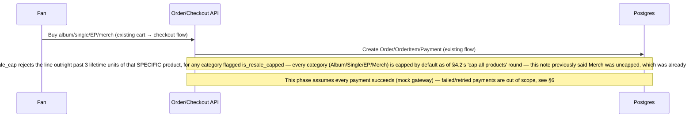
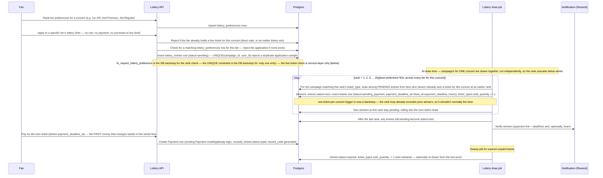

# データベース設計 — アイドル公演チケット予約 + アルバム／シングルのマーケットプレイス

[English](database-design.md) | 日本語

`../CLAUDE.md` および `architecture_JP.md`/`project_status_JP.md` と対になるドキュメントです。全体を通して参照用の DDL
として `schema.sql` を引用していますが、これはリポジトリ内のファイルとしては存在しません — すべての引用は、稼働中の
マイグレーションからまだ抽出されていない DDL を指しているものとして扱ってください（`project_status_JP.md` を参照）。
`docs/` には編集可能な draw.io のエクスポートが 2 つあります: `idol-ticket-erd.drawio`（§2 の ER 図、全 31 テーブル。
`notifications`/`inquiries` のための「Shared」クラスターを含む）と `lottery-business-logic.drawio`（§5 のビジネスロジックの
フローチャート）— どちらも [diagrams.net](https://app.diagrams.net) またはデスクトップアプリで開いて編集できます。

**元の草案（提示されたまま）:**
- ユーザーは 3 種類: 管理者、事務所のマネージャー、エンドユーザー（アルバムとチケットを購入するファン）。
- アイドルとグループは、それぞれちょうど 1 つの事務所に所属する。
- アイドルは次を持つ: 生年月日、出身地、特技、短い紹介文、長い説明文、グループ内のポジション
  （ギタリスト／ボーカル／ダンサー／ビジュアル／など）。
- 公演／イベントは、事務所が予約した会場で行われる。
- 座席チケットには VIP、Premium、Regular のティアがある。
- 主なビジネスロジック: アルバムを買う → 抽選に参加できる → ランダムなアルゴリズムで抽選する → 当選者はチケットを
  購入する枠を得る → ユーザーに通知される → ユーザーが支払う。
- マネージャー／管理者はアイドル、グループ、イベント、アルバム／シングルを CRUD できる。管理者はすべての権限を持つ。
  ファンはイベント／アイドルの情報を閲覧し、グッズとチケットを購入することしかできない。

**置き換え済み:** 上記の「アルバムを買う → 抽選に参加できる」というつながりは当初の仕組みだったが、後のスコープ変更
（§3.13、§5）で意図的に取り除かれた — 何かを購入することと抽選に応募することは、今では完全に独立した 2 つのフローで
ある。上の元の箇条書きは初期草案の歴史的な記録として残しているが、それに基づいて実装せず、代わりに §5 を読むこと。

**ユーザーと確認した設計上の選択:** 券種は **座席指定ではなくキャパシティベース** — ティア（VIP/Premium/Regular）は
個々の番号付きの座席ではなく、公演ごとの総数を持つ。これにより、スキーマは会場 → セクション → 座席という階層では
なく、公演ごと・ティアごとに 1 行の `ticket_types` で済み、それでいて価格設定、抽選、購入を完全にサポートできる。

**ユーザーと確認した設計上の選択:** すべてのテーブルの主キー（とすべての外部キー）は連番の整数ではなく `uuid`
（Postgres ネイティブの `uuid` 型、デフォルトは `gen_random_uuid()`／アプリ側の `uuid4()`）である — 連番の ID だと、
誰でもリソースを列挙して（`/products/search/2`、`/products/search/3`、...）テーブルをスクレイピングしたり、推測できては
ならない ID（他のユーザーのカート、注文、チケット）を探ったりできてしまう。これはスキーマ全体に後から適用した変更で
あり（以下の `int`/`INTEGER` の ID はすべて `uuid` と読み替えること）、このドキュメント全体でテーブルごとに描き直しては
いない。

## 1. エンティティの概要

4 つのクラスターがあり、そのうち 3 つが新規:

1. **Identity**（既存の `users` テーブルを拡張）— ロールベースのアクセス制御: `admin`、`manager`、`fan`。
2. **Talent**（新規）— `management_companies`、`groups`、`idols`、`idol_colors` ルックアップ（各アイドルの
   シグネチャー／メンバーカラー）、`positions` ルックアップ + `idol_positions` 結合テーブル（アイドルは複数の
   ポジションを持てる。例:「メインボーカル兼リードダンサー」— このリストは増え続けるので、固定の enum ではなく
   テーブルとしてモデル化している）。
3. **Events & ticketing**（新規）— `venues`（キャパシティから導出される `size` ティア）、`concerts`（独自の
   `capacity`）、`concert_performers`（どのアイドル／グループが公演に出演するか）、`ticket_types`（公演ごとの
   VIP/Premium/Regular のティア）、`lottery_preferences`（ある公演に対するファンの順位付きのティアの希望）、
   `lottery_campaigns`、`lottery_entries`、`direct_sale_campaigns`（一般販売のティアの販売期間、§3.21）、`tickets`。
4. **Marketplace**（既存の `products`/`categories`/`cart`/`orders`/`payment`/`shipping_*` テーブルを拡張）—
   `categories` は今や「これはどんな種類の商品か」の唯一の正となる情報源である（Album/Single/EP/Merch を投入 —
   **5 つではなく 4 つのカテゴリ**: 「Lightstick」は「Merch」に統合された。§3.17 の「今回統合」の注記を参照）。そして
   `products` には 2 つの新しい 1:1 の詳細テーブルがぶら下がる: `album_details`（アルバム、シングル、EP を一律に
   カバーする — §3.16 を参照）と `merch_details`（今回新規。ペンライトと、1 人のアイドルまたは 1 つのグループに
   紐づくその他の公式グッズをカバーする）。`genres`/`album_genres` は、カテゴリに関係なくすべての `album_details` 行に
   多対多のジャンルタグを付けるので、既存のカート／購入／決済／配送の仕組みは、今日の汎用的な商品と同じように、
   アルバム、シングル、EP、グッズでもそのまま動き続ける。**これを使えるのはファンだけ** — §4.1 を参照。
5. **Shared**（元の検討ラウンドの後に追加）— `notifications`（§3.19）と `inquiries`（§3.20）、加えて既存の
   `refresh_tokens`。

## 2. ERD

```mermaid
erDiagram
    USERS ||--o{ IDOLS : "manages (via company)"
    USERS {
        uuid id PK
        string name
        string email
        user_role_enum role
        uuid company_id FK "nullable, set for role=manager"
    }

    MANAGEMENT_COMPANIES ||--o{ GROUPS : owns
    MANAGEMENT_COMPANIES ||--o{ IDOLS : owns
    MANAGEMENT_COMPANIES ||--o{ CONCERTS : organizes
    MANAGEMENT_COMPANIES ||--o{ USERS : employs

    GROUPS ||--o{ IDOLS : "has members (optional)"
    GROUPS {
        uuid id PK
        uuid company_id FK
        string name
        date debut_date
        string description
    }

    IDOLS {
        uuid id PK
        uuid company_id FK
        uuid group_id FK "nullable — solo idols allowed"
        string name
        date date_of_birth
        string hometown
        uuid color_id FK "nullable — member/signature color"
        string short_intro
        string long_description
    }

    IDOL_COLORS ||--o{ IDOLS : "signature color"
    IDOL_COLORS {
        uuid id PK
        string name
        string hex_code
    }

    POSITIONS ||--o{ IDOL_POSITIONS : ""
    IDOLS ||--o{ IDOL_POSITIONS : ""
    IDOL_POSITIONS {
        uuid idol_id FK
        uuid position_id FK
        bool is_primary
    }

    VENUES ||--o{ CONCERTS : hosts
    VENUES {
        uuid id PK
        string name
        string city
        int total_capacity
        venue_size_enum size "generated from total_capacity"
    }
    CONCERTS ||--o{ CONCERT_PERFORMERS : features
    IDOLS ||--o{ CONCERT_PERFORMERS : performs
    GROUPS ||--o{ CONCERT_PERFORMERS : performs
    CONCERTS {
        uuid id PK
        uuid company_id FK
        uuid venue_id FK
        string title
        int capacity "this event's capacity, may be <= venue.total_capacity"
        timestamp event_datetime
        concert_status_enum status
    }

    CONCERTS ||--o{ TICKET_TYPES : offers
    TICKET_TYPES {
        uuid id PK
        uuid concert_id FK
        ticket_tier_enum tier "vip / premium / regular"
        numeric price
        int total_quantity
        int sold_quantity
        sale_method_enum sale_method "lottery / direct"
    }

    CONCERTS ||--o{ LOTTERY_PREFERENCES : "ranked by"
    USERS ||--o{ LOTTERY_PREFERENCES : ranks
    TICKET_TYPES ||--o{ LOTTERY_PREFERENCES : "ranked as a choice"
    LOTTERY_PREFERENCES {
        uuid concert_id FK
        uuid user_id FK
        uuid ticket_type_id FK
        smallint rank "1 = first choice"
    }

    TICKET_TYPES ||--o{ LOTTERY_CAMPAIGNS : "runs a lottery for"
    LOTTERY_CAMPAIGNS ||--o{ LOTTERY_ENTRIES : collects
    USERS ||--o{ LOTTERY_ENTRIES : "applies directly (free, no purchase)"
    LOTTERY_ENTRIES {
        uuid campaign_id FK
        uuid user_id FK
        lottery_entry_status_enum status
    }

    TICKET_TYPES ||--o{ DIRECT_SALE_CAMPAIGNS : "on-sale window for (direct only)"
    DIRECT_SALE_CAMPAIGNS {
        uuid id PK
        uuid ticket_type_id FK
        timestamptz sale_start_at
        timestamptz sale_end_at "CHECK > sale_start_at"
        direct_sale_campaign_status_enum status "open / cancelled"
    }

    LOTTERY_ENTRIES ||--o| TICKETS : "wins →"
    TICKET_TYPES ||--o{ TICKETS : issues
    USERS ||--o{ TICKETS : owns
    PAYMENT ||--o| TICKETS : settles

    CATEGORIES ||--o{ PRODUCTS : classifies
    CATEGORIES {
        uuid id PK
        string name UQ "Album / Single / EP / Merch"
        bool is_resale_capped "drives the anti-resale trigger, §4.2"
    }

    PRODUCTS ||--o| ALBUM_DETAILS : describes
    IDOLS ||--o{ ALBUM_DETAILS : "credited artist (nullable)"
    GROUPS ||--o{ ALBUM_DETAILS : "credited artist (nullable)"
    ALBUM_DETAILS {
        uuid product_id PK_FK
        uuid idol_id FK "nullable"
        uuid group_id FK "nullable"
        date release_date
        int track_count
        release_format_enum format "physical / digital"
    }
    ALBUM_DETAILS ||--o{ ALBUM_GENRES : ""
    GENRES ||--o{ ALBUM_GENRES : ""
    ALBUM_GENRES {
        uuid product_id FK
        uuid genre_id FK
    }
    GENRES {
        uuid id PK
        string name
    }

    PRODUCTS ||--o| MERCH_DETAILS : describes
    IDOLS ||--o{ MERCH_DETAILS : "owner (XOR with group)"
    GROUPS ||--o{ MERCH_DETAILS : "owner (XOR with idol)"
    IDOL_COLORS ||--o{ MERCH_DETAILS : "shell/light color (nullable)"
    MERCH_DETAILS {
        uuid product_id PK_FK
        uuid idol_id FK "nullable, XOR with group_id"
        uuid group_id FK "nullable, XOR with idol_id"
        string edition "e.g. Ver. 3 (nullable) — lightsticks only, generic for other merch"
        uuid color_id FK "nullable"
    }

    USERS ||--o{ NOTIFICATIONS : "receives (§3.19)"
    USERS |o--o{ INQUIRIES : "submits (nullable — guests allowed, §3.20)"
```

*（`PRODUCTS`、`PAYMENT`、`CATEGORIES` は現在のコードベースの既存テーブルで、新しいテーブルがそれらに接続する箇所
（`CATEGORIES` の場合は、今回新しいカラム `is_resale_capped` が追加される箇所）だけを示しており、完全には描き直して
いない。`ORDERS_ITEMS` も既存のテーブルで、転売防止のトリガーがそれに接続する（§4.2）が、新しいテーブルでそれへの
FK の関係を持つものがないので、ここでは描いていない。）*

## 3. テーブルごとの解説

### 3.1 `users`（新規ではなく変更）

`role user_role_enum NOT NULL DEFAULT 'fan'` と `company_id UUID NULL REFERENCES management_companies(id)` を追加する。
`company_id` は `role = 'manager'` のときにだけ設定される — その組み合わせはサービス層（`user_service`）で強制する。
コードベースがすでに `user_id` のスコープを DB 制約ではなくサービス関数で強制しているのと同じやり方である。

**マイグレーションの進め方**（`project_status_JP.md` §4 の項目 3 と一致 — これの *前に* `base.py` の欠けている
インポートを修正する）: 新しいマイグレーションで `role` を追加し、`is_admin = true` なら `role = 'admin'`、それ以外は
`'fan'` でバックフィルし、どのコードも参照しなくなったら **別の後続のマイグレーション** で `is_admin` を削除する。
両方を 1 つのマイグレーションで行わないこと — 既存の `alembic/versions/` の規約どおり、1 マイグレーションにつき
1 つの関心事。

### 3.2 `management_companies`（新規）

マネジメント／エンターテインメントの事務所 — `manager` アカウントのテナント境界。`id`、`name`、`description`、
`contact_email`、`created_at`。

### 3.3 `groups`（新規）

`id`、`company_id`（FK、必須）、`name`、`debut_date`、`description`、`is_active`（bool、デフォルト `true` — 下記参照）、
`created_at`、`updated_at`。草案どおり、グループは常にちょうど 1 つの事務所に所属する。

`is_active`（マイグレーション `a1f3c9d27e56`、既存の `users.is_active` と同じ形）: `DELETE /groups/delete/{id}` は
行を削除する代わりにこれを `false` にし、`PATCH /groups/activate/{id}` で元に戻す。追加した理由は、
`concert_performers.group_id` が `ondelete="CASCADE"` で、`album_details`/`merch_details.group_id` が
`ondelete="SET NULL"` だからである — 公演や商品の履歴を持つグループに本当に `db.delete()` をすると、すでに行われた
公演の出演者の記録が消えたり、実際の注文履歴がある商品のアーティストの帰属が宙に浮いたりしてしまう。その場で無効化
すれば、すべての FK の参照先が生き続ける。ストア向けの読み取り（`get_groups`、`get_groups_page`、`get_group_detail`）は
`is_active=True` にフィルタする。マネージャー／管理者の設定画面の読み取りと、単純な ID による取得は意図的にフィルタ
しないので、マネージャーは無効化されたグループを読み込んで確認／再有効化できる。

グループを無効化しても、そのアイドルには **連鎖しない** — グループの所属はすでにソロのアイドルを（削除ではなく）
`group_id IS NULL` としてモデル化しているので、グループが無効になったアイドルは単に `group_id` を保持したまま影響を
受けない。これは「所属はアイドル自身のライフサイクルとは独立している」という同じ考え方と一致する。そのアイドルは
自分のプロフィールページでは引き続き表示される。ただ、もう閲覧できなくなったグループのアクティブなメンバーとしては
表に出なくなるだけである。

ただし、無効化されたグループは *新しい* 所属や商品に対しては閉じられる: `idol_service.add_idol`/`update_idol` は
アイドルを無効なグループに割り当てることを拒否し（`"group_inactive"` センチネル、400）、
`album_detail_service.add_album_detail`/`merch_detail_service.add_merch_detail` は新しいリリース／グッズをそれに紐づける
ことを拒否する（`"artist_inactive"` センチネル、400）— 活動を終えたグループの後ろに新しい仕事が積み上がらないように
するという同じ考え方であり、すでに紐づいているもの（既存のメンバー、過去のリリース）はそのまま残る。

### 3.4 `idols`（新規）

`id`、`company_id`（FK、**必須** —「アイドルは 1 つの事務所にだけ所属する」はグループのないソロのアイドルにも
当てはまる）、`group_id`（FK、**nullable** — ソロの活動も存在する）、`name`（単一のフィールド — 芸名／本名の区別は
なく、`real_name` は意図的に延期しており、現時点ではまったくモデル化していない）、`date_of_birth`、`hometown`、
`color_id`（FK → `idol_colors`、nullable — §3.5 を参照。削除された以前の `talent` フィールドを置き換える）、
`short_intro`（短いテキスト）、`long_description`（長いテキスト）、`profile_image_url`、`is_active`（bool、デフォルト
`true` — `groups.is_active`（§3.3）と同じ論理削除の理由: `concert_performers.idol_id` が `ondelete="CASCADE"` で、
`album_details`/`merch_details.idol_id` が `ondelete="SET NULL"` なので、`DELETE /idols/delete/{id}` はハードデリートの
代わりに無効化し、`PATCH /idols/activate/{id}` でそれを元に戻す）、`created_at`、`updated_at`。後で無効化される
グループに割り当てられたアイドルは影響を受けない — 無効化は両者の間で連鎖しない（§3.3）— が、無効化された
*アイドル* は、無効化されたグループと同じように新しい紐づけを受け付けなくなる: `album_detail_service`/
`merch_detail_service` は、無効なアイドルに新しいリリース／グッズを紐づけることを拒否する（`"artist_inactive"`、400）。

アプリケーションレベルの不変条件（DB 制約ではない。コードベースがすでにフィールド間の検証をトリガーではなく
サービスで扱っているのに合わせている）: `group_id` が設定されている場合、アイドルの `company_id` はそのグループの
`company_id` と等しくなければならない。作成／更新時に `idol_service` でこれを強制する。

### 3.5 `idol_colors`（新規）

`id`、`name`（一意）、`hex_code`（`#RRGGBB`、一意、6 桁の 16 進数値として `CHECK` で検証）。`idols` から削除された
`talent` フィールドを置き換える — 自由記述の特技の説明の代わりに、各アイドルはシグネチャー／メンバーカラー
（`color_id`、nullable）を持つ。`positions`（§3.6）や `genres`（§3.18）と同じルックアップテーブルの理由: 固定の
Postgres の enum ではなく、終わりのない増え続けるパレットなので、マネージャー／管理者はマイグレーションなしで新しい
色合いを追加できる。

シードデータ（`schema.sql` §2）は、かわいいパステル／ビビッドな「メンバーカラー」のパレット — Cotton Candy Pink、
Butter Yellow、Sky Mint、Lavender Dream、Peach Sorbet、Baby Blue、Lilac Bloom、Mint Cream、Coral Blush、Periwinkle Pop、
Bubblegum Purple、Tangerine Pop — の 12 色から始め、自由に拡張できる。

DB では強制しないが、サービス層での推奨に値する点: *同じ* グループの 2 人のメンバーが同じ色を共有するのはおそらく
避けるべきである（一目でメンバーを見分けることこそがメンバーカラーの目的）。一方、別々のグループや事務所をまたいだ
再利用はまったく問題ない。`UNIQUE(group_id, color_id)` 制約ではなく、`idol_service` のゆるい検証として残している。
DB のハードな制約はトリガーなしでは結合を通して `group_id` を見ることができず、これは §4 のトリガーが扱うような
お金／公平性の不変条件ではないからである。

### 3.6 `positions` + `idol_positions`（新規）

`positions`: `id`、`name` — ルックアップテーブル（Leader、Main Vocalist、Vocalist、Lead Dancer、Dancer、Rapper、Visual、
Center、Maknae、Guitarist、Bassist、Drummer、Producer、...）。一般的な値を投入してあるが、スキーマの変更なしに
**マネージャー／管理者が拡張できる** — これは意図的に Postgres の enum ではなくテーブルにしている。
「ギタリスト／ボーカル／ダンサー／ビジュアル／など」は終わりのないリストで増え続け（バンド型の活動には、純粋な
アイドルグループの enum にはない楽器の役割が必要になる）、Postgres の enum 型を変更するのは行を挿入するより影響が
大きいからである。

`idol_positions`: `idol_id`（FK）、`position_id`（FK）、`is_primary`（bool）— 複合主キーは `(idol_id, position_id)`。
アイドルは複数のポジションを持てる（例:「メインボーカル兼リードダンサー」）。`is_primary` は UI で最初に表示する
ものを示す。

### 3.7 `venues`（新規）

`id`、`name`、`address`、`city`、`country`、`total_capacity`、`contact_info`、`created_at`。会場は事務所から独立した
再利用可能なエンティティ — 事務所は公演ごとに会場を *予約* するのであって、所有するわけではない。

`size`（`venue_size_enum`: small / medium / large / stadium）は、`total_capacity` から計算される **生成カラム**
（`GENERATED ALWAYS AS (...) STORED`）であり、誰かが設定する値ではない:

| `total_capacity` | `size` |
|---|---|
| < 10,000 | small |
| 10,000 – 19,999 | medium |
| 20,000 – 49,999 | large |
| ≥ 50,000 | stadium |

独立して保存するのではなく導出することで、`size` が `total_capacity` と食い違うことは物理的にありえなくなる —
「誰かがキャパシティを更新したのにティアの更新を忘れた」という種類のバグは存在しない。ティアの境界を変える必要が
出てきても、それは 1 行の `ALTER TABLE ... ALTER COLUMN size ...`（生成式の再定義）で済み、すでに間違っている行を
直すためのデータマイグレーションは必要ない。

### 3.8 `concerts`（新規）

`id`、`company_id`（FK — 主催する事務所）、`venue_id`（FK）、`title`、`description`、`capacity`（この特定のイベントの
キャパシティ — `venues.total_capacity` と等しいとは限らない。事務所は大きな会場で、規模を縮小した／一部だけを使う
イベントを開催できる）、`event_datetime`、`doors_open_at`、`status`（`concert_status_enum`: scheduled / on_sale /
sold_out / completed / cancelled）、`created_at`、`updated_at`。

`capacity <= venues.total_capacity` は DB 制約として **強制しない**（`CHECK` はトリガーなしでは別のテーブルを参照
できず、この関係は下記のチケット数の上限のような公平性／お金の不変条件ではない）— この設計の他のすべての箇所と
同じサービス層のパターンで、作成／更新時に `concert_service` で検証する。

公演のすべてのティアにわたる `SUM(ticket_types.total_quantity)` は、今では DB で **強制している** — §3.10 を参照。

### 3.9 `concert_performers`（新規）

`concert_id`（FK）、`idol_id`（FK、nullable）、`group_id`（FK、nullable）— 各行で `idol_id`/`group_id` のちょうど
一方が設定される（`schema.sql` の `CHECK` 制約がこれを強制する）。多対多の結合テーブルで、複数のアイドル／グループに
よる合同公演をサポートする。

### 3.10 `ticket_types`（新規）

公演ごと・ティアごとに 1 行ではなく、**最大 2 行** — `sale_method` ごとに 1 行: `id`、`concert_id`（FK）、`tier`
（`ticket_tier_enum`: vip / premium / regular）、`price`、`total_quantity`、`sold_quantity`（デフォルト 0 —
`Product.quantity` がすでに在庫を管理しているのと同じように `sold_quantity` を持つので、購入時と同じ行ロックが必要に
なる。対応済み、`project_status_JP.md` §4 の項目 1 を参照）、`sale_method`（`sale_method_enum`: lottery / direct）、
`created_at`。`(concert_id, tier, sale_method)` で一意。

`sale_method = 'direct'`（草案では「予約」と呼ばれていた）は **抽選を飛ばす選択肢で、同じティアの `lottery` の行より
高い価格** が付く — 事務所は、例えば VIP チケットを抽選（安い）と直接購入／予約（高い、抽選なし、待ち時間なし）の
両方で販売できる。すべてのティアに両方が必要なわけではない: 事務所は Regular を一般販売のみにし、VIP をすべて抽選用に
取っておくこともできる。抽選より高いという価格のルールは DB 制約では **ない**（兄弟行同士の価格を比べるには別の
トリガーが必要になり、ティアが `sale_method` を 1 つしか持たないことも許されているので、「何より高いのか」が定義
できない）— これはマネージャーの UI／サービス層のガイドラインである。

**DB で強制するハードな制約:** 公演のすべてのティア／販売方式にわたる `SUM(ticket_types.total_quantity)` は
`concerts.capacity`（§3.8）を超えてはならない。素の `CHECK` では兄弟行をまたいで集計できないので、トリガー
（`fn_enforce_concert_ticket_capacity`、`schema.sql` §3）で強制する。

**ファンは同じ公演で両方の経路を同時に開いておくことはできない — トリガーではなくサービス層のチェック**。
`ticket_service.checkout_ticket()` の既存の `trg_tickets_one_per_concert` という保険とあわせて追加した:
- 抽選のティアへの応募（`lottery_entry_service.apply_to_lottery`）は、その公演の *有効な* チケット（`Ticket.status` が
  `reserved`/`pending_payment`/`paid`/`used`）をすでに持っているファンも拒否するようになった — `direct` の販売で購入
  したものでも、先のティアの抽選で当選したものでも。そのチケットを買ったということは、すでに枠を持っているという
  ことであり、その上で別のティアの抽選に応募しても利点はなく、後で当選すると 1 つの公演で 2 枚のチケットを持つ
  リスクが生じる。
- `direct` のティアの購入（`ticket_service.checkout_ticket`）は、その公演に対して未解決の抽選応募を持つファンも拒否
  するようになった — 同じ公演のティアに対する、まだ `pending` または `won` のそのファンの `lottery_entries` 行。この
  ゲートを通れるのは `lost`（または応募なし）だけ。これは `trg_tickets_one_per_concert` だけでは捕まえられない
  ケースを捕まえる: 抽選のティアで **当選した** のに、その結果のチケットの `payment_deadline_at` を過ぎさせてしまった
  （`status` → `expired`）ファンは、もう *有効な* チケットを持っていないが、`lottery_entries.status` はまだ `won` の
  ままである — このチェックがなければ、同じ公演を一般販売で買えてしまうが、当選の支払い期限を逃しただけでそれを
  許すことはこの設計の意図ではない。

どちらのチェックも普通のビジネスルールの検証であり、§4.1 がトリガーに値するかどうかの基準として使うような
お金／公平性の不変条件ではない（どちらにもトリガーの裏付けはない）— このドキュメントの他の箇所で、抽選の希望や
カテゴリと詳細テーブルのようなチェックにすでに適用しているのと同じ考え方である。

### 3.11 `lottery_preferences`（新規）

`id`、`concert_id`（FK）、`user_id`（FK）、`ticket_type_id`（FK — 順位を付けるティア）、`rank`（smallint、1 = 第一
希望）、`created_at`。`(concert_id, user_id, rank)` で一意（2 つのティアに同じ順位を付けられない）かつ
`(concert_id, user_id, ticket_type_id)` で一意（同じティアに 2 回順位を付けられない）。**確認済み:** `concert_id` は
（`ticket_type_id` → `concerts` の結合で導出するのではなく）このテーブルに直接置く — それによって、上の順位の一意性
制約と、下の「先に希望が必要」というチェックの両方が、毎回 `ticket_types` を通して結合することなく、公演でこの
テーブルを直接問い合わせられる。

**ハードなルール:** ファンがここでそのティアにすでに順位を付けていない限り、そのティアの抽選には **一切参加
できない**。新しい `lottery_service`（`order_service` ではない — 下記のスコープ変更を参照）は、`lottery_entries` への
挿入を試みる前に、一致する希望があるかをチェックすべきである。`fn_require_lottery_preference`（`schema.sql` §3）は
そのチェックの DB レベルの保険で、ファンのみ購入可能というルール（§4.1）と同じ「まずサービス層、保険として
トリガー」という形である。

これが **「ファンは 1 つの公演で最大 1 枚のチケットしか当選しない。希望の順に繰り下がる」**（確認済み）の仕組みで
ある: ファンは抽選の *前に*、ある公演について受け入れられるティアに順位を付ける（第一希望 VIP、第二希望 Premium、
第三希望 Regular — または任意の部分集合を任意の順で）。抽選ジョブ（§5）はまず、すべてのティアにわたって順位 1 を
処理する — 第一希望で当選した人はそこで終わり。次に順位 2 が、順位 1 でまだ当選していないファンの中だけで抽選され、
以下同様に続く。そのためファンは、1 公演 1 チケットのトリガー（§3.14）が後から 2 枚目を拒否するからではなく、
構造上、同じ公演のチケットを 2 枚持つことがない — そのトリガーは今では主要な仕組みではなく保険である。

`sale_method = 'lottery'` の `ticket_types` でのみ意味を持つ — `direct` のティアに順位を付けても、繰り下げる抽選が
ないので何の意味もない。DB では強制せず、アイドル／グループの事務所の一致（§3.4）と同じパターンで、ファンが希望を
設定するときにサービス層で検証する。

**今回 DB で強制するようになった:** `ticket_type_id` は実際に `concert_id` に属していなければならない — 以前は §6 で
「まだ未解決」のリスクとして挙げていたが、今は `trg_lottery_preferences_ticket_type_concert`（`schema.sql` §3）で
解決した。これがないと、食い違った行は書き込み時にエラーにならず — 抽選は常に `(concert_id, ticket_type_id)` の組で
希望を探す（§5.2）ので、抽選ジョブに黙って拾われないだけになる。順位を付けたティアが黙って無視されるファンという
のは、この設計がトリガーを取っておく種類の静かな公平性のバグ（§4.1 の基準）そのものなので、これは「普通の
テーブル間の検証」（アイドル／グループの事務所の一致のようにアプリレベルに留まる）から「DB の保険に値する」へと
一線を越えた。

### 3.12 `lottery_campaigns`（新規）

`ticket_types` の行を抽選の期間に結びつける: `id`、`ticket_type_id`（FK）、`entry_start_at`、`entry_end_at`、`draw_at`、
`payment_deadline_hours`（当選者が枠を解放されるまでに支払うべき時間。確認済み: **支払いは抽選の後、当選者だけが
行う** — 応募するだけで前払いで課金されるものは何もない）、`max_entries_per_user`（今回新規 — §3.13 を参照）、
`status`（`campaign_status_enum`: open / drawn / completed / cancelled）、`created_at`。

**スコープ変更:** 以前の `lottery_campaign_eligible_products` テーブル（どのアルバム／シングルの SKU がキャンペーンへの
応募権を得るか）は **なくなった**。購入がキャンペーンへの応募権を「得る」という概念自体がもう存在しない — §3.13 を
参照。

### 3.13 `lottery_entries`（新規）— スコープ変更: 購入と抽選への応募は今や別物

**今回解決し、以前の設計からの大きな変更:** アルバム／シングル／EP／グッズを購入しても抽選の応募権は **決して**
得られず、抽選への応募に何かを購入している必要も **決して** ない。2 つのシステム — マーケットプレイス
（§3.15–3.18）と抽選 — は今や完全に独立している。ファンは抽選に直接応募し（購入の副作用ではなく新しい
エンドポイント）、それには何の費用もかからない。支払うのは *当選した* チケットだけである（§3.14）。

直接の応募 1 件につき 1 行: `id`、`campaign_id`（FK）、`user_id`（FK）、`status`（`lottery_entry_status_enum`: pending /
won / lost / expired）、`created_at`、`drawn_at`。それだけ — **`source_order_item_id` と `entries_count` はどちらも
なくなった**。それらが提供していた監査証跡（「どのアルバムの購入がこの応募権を得たか」）と、それらが支えていた
「アルバム 3 枚で 3 回挑戦」の仕組みも一緒に。どちらにも代わりはない。単に、もうたどるべき購入がないのである。

**DB で強制するハードな上限で、今回、マイグレーションなしで緩められるように作った:** キャンペーンごと・ユーザー
ごとに最大 `lottery_campaigns.max_entries_per_user` 件の応募。デフォルトは **1** —「今のところ応募は 1 回だけ」は
今日もそのまま正しい。以前（前回のラウンド）は素の `UNIQUE (campaign_id, user_id)` 制約だったが、それはなくなった。
UNIQUE 制約では構造的に、キャンペーンごと・ユーザーごとに 1 行より多くを許すことが *できない* — 後で上限を上げるには
制約を削除して置き換える、つまりポリシーの変更であるべきことのためにマイグレーションが必要になっていた。今は
`fn_enforce_lottery_entry_cap`（`schema.sql` §3）で、その `(campaign_id, user_id)` の既存の応募を数えて
`max_entries_per_user` と比較するトリガーである —「設定可能なフラグはハードコードされた上限に勝る」という
`categories.is_resale_capped`（§3.15）と同じ手である。後で特定のキャンペーンの上限を上げるのは
`UPDATE lottery_campaigns SET max_entries_per_user = ...` であり、スキーマの変更ではない。

**（今のところ）API では公開していない:** `LotteryCampaignCreate`/`Update` は `max_entries_per_user` を受け付けない
ので、すべてのキャンペーンはデフォルトの 1 のままになる。抽選のロジックは、キャンペーンごと・ユーザーごとに応募が
1 件であることを前提にしている: 複数あると、`sample()` が 1 つのティアで同じファンを 2 回選ぶことがありうる
（`docs/bugs_JP.md` #6）。これを再び設定可能にする前に、抽選が候補をユーザー単位で重複除去しなければならない。

購入に紐づいた古い `entries_count` カラムの復活では **明確にない**: あれは購入したものに紐づく *応募* 単位の倍率
（アルバム 3 枚 = 3 回）だった。`max_entries_per_user` は *キャンペーン* 単位のポリシーのつまみで、どちらにせよ購入とは
無関係である — 以前のスコープ変更による購入と抽選の分離（§3.13 自身の経緯）は、これによって何も変わらない。

もう 1 つのハードなルールは変わらない: 応募するティアについて、`lottery_preferences` 行がすでに存在していなければ
ならない（§3.11 の「順位なしでは応募なし」のルール、`fn_require_lottery_preference`）— 順位を付けていない抽選への応募は
依然としてはっきり拒否され、今回は *応募* そのものの拒否になる（手を付けずに残すべき購入はもうない）。

### 3.14 `tickets`（新規）

実際に発行されたチケット: `id`、`ticket_type_id`（FK）、`user_id`（FK）、`lottery_entry_id`（FK、**nullable** — 抽選を
飛ばして直接購入したチケットでは null）、`payment_id`（既存の `payment` テーブルへの FK、支払われるまで nullable）、
`status`（`ticket_status_enum`: reserved / pending_payment / paid / cancelled / expired / used）、`issued_code`（一意 —
QR／チケットのコードで、`status` が `paid` になったときに生成される）、`reserved_at`、`payment_deadline_at`、
`created_at`、`updated_at`。

チケットには配送の記録はない — 引き続き `shipping_addresses`/`shipping_status` を使う物理的なアルバム／グッズの注文とは
違い、チケットは本来デジタルなもの（`issued_code`）である。

**DB で強制するハードな上限（保険）:** `(user_id, concert)` ごとに *有効な* チケットは最大 1 枚 —「有効な」チケットとは
`status` が `reserved`、`pending_payment`、`paid`、`used` のもの。`cancelled` や `expired` のものは数えないので、そう
やってチケットを失ったファンは再挑戦できる。これは **ティアをまたいで、そして `sale_method` をまたいで** 適用される —
ファンは抽選で当選した Regular のチケットを持ちながら、同じ公演の VIP チケットを一般販売で買うことはできない。
どうやって手に入れたかにかかわらず、1 公演につき 1 枚である。`fn_enforce_one_ticket_per_concert`（`schema.sql` §3）で
強制し、`tickets` は `concert_id` を直接保存していないので、`ticket_type_id` からそれを解決する。

§3.11 のとおり、これは **主要な仕組みではなく保険** である: 抽選ジョブは各ファンを `lottery_preferences` の順位の順に
繰り下げ、当選した時点で止めるので、通常の抽選の経路で同じ公演に 2 枚目のチケットの挿入を試みることは実際には
ないはずである。このトリガーは、一般販売／「予約」の経路（ファンが抽選ですでに当選した公演の一般販売のチケットを
買おうとすることがありうる）と、抽選ジョブにバグがあった場合の安全網として依然として重要である。

### 3.15 `categories`（新規ではなく変更）— 商品の種類の唯一の正となる情報源

**今回の正規化。** `categories` はすでに存在していた（`id`、`name`）が、何もそれに本当の意味を与えていなかった —
`Product` が持てる任意のラベルにすぎなかった。

**実際のマイグレーションの履歴と照合した訂正**（以前ここで頼っていた稼働中のモデルだけではなく）: `name` は最初の
`categories` のマイグレーション（`f2a3135a19da_create_category_table.py`）からすでに `UNIQUE` だった — モデル
（`app/db/models/marketplace/category.py`）がそれを宣言していなかっただけで、これは本当の、しかし別のモデルと DB の
食い違いであり、**現在は修正済み** — `Category.name` は `unique=True` を宣言しており、DB の制約はすでにあったので
マイグレーションは不要。そのため、この ALTER で一意性のために追加するものは何もなかった。`schema.sql` §4a ももう
それを試みていない（元々は試みており、エラーになるのではなく、冗長な 2 つ目の一意インデックスを作ってしまうところ
だった — 実際のマイグレーションで出荷される前に捕まえておく価値のある罠だった）。ここでの実際の変更はこれだけ:

- `is_resale_capped BOOLEAN NOT NULL DEFAULT true` を追加 — 転売防止のトリガー（§4.2）は、「上限あり」のカテゴリ名の
  リストをハードコードしたり、（古いやり方で）詳細の行がたまたま存在するかどうかから「これは上限のある商品か」を
  推測したりする代わりに、このフラグを読むようになった。後でカテゴリを転売上限の *対象外* にするのはデータの変更で
  あり、トリガーの書き換えではない。

5 行を投入: `Album`、`Single`、`EP`、`Lightstick`、`Merch` — 今回の時点で **5 つすべてが `is_resale_capped = true`**
（「マーケットプレイスのすべての商品に上限をかける」。以前は Album/Single/EP/Lightstick だけに上限があり、Merch は
対象外だった）。フラグとデフォルトの両方が `true` に反転したので、将来の対象外はオプトインではなくオプトアウトに
なるが、仕組みはそれ以外変わらない — §4.2 を参照。

**今回統合: `Lightstick` → `Merch`。投入するカテゴリは 5 つではなく 4 つ。** この設計の実際のビジネスルールで、
ペンライトとその他の公式グッズを区別するものは何もなかった — 転売上限はすでに両方に同じように適用されており、
事務所の所有者の解決も同じたどり方（アイドル／グループ → `company_id`、§3.17 を参照）で、厳密な XOR による
「所有者はちょうど 1 つ」というルールさえ、本当はペンライト特有のものではなかった。`Lightstick` は、このドキュメントの
設計の経緯のどこにも機能上の理由が記録されていないのに、独自のトップレベルの枠を持つ唯一の音楽以外のカテゴリ
だった — マイグレーション `b60aec9ffc02` は、既存の `Lightstick` に分類された商品をすべて `Merch` にバックフィルし、
カテゴリの行を削除する。同じマイグレーションで `lightstick_details` は `merch_details` に改名される — §3.17 を参照。

**`products.category_id` は今や `NOT NULL`** — マイグレーション
`71b1b0443c96_make_products_category_id_not_null.py` で反映済みで、カラムを厳しくする前に、既存のカテゴリなしの商品を
`Merch` にバックフィルする。これは実際のマイグレーションのチェーンで、この ALTER の残りより先に入った（既存の
テーブルにしか触れないので、マーケットプレイスのクラスターの残りを待つ必要がなかった）。`schema.sql` §4a も同じことを
記している。

**これは `album_details.release_type` を置き換える。** 古い `release_type_enum` カラム（album / single / ep）は、
`products.category_id` が今主張しているのとまったく同じ事実を主張していた — 2 つのカラムで 1 つの事実を持てば、
いずれ必ず食い違う。これは削除した。「これはどんな種類の商品か」を記録する場所は `categories.name` だけであり、
§3.16/§3.17 はその種類に固有の事実だけを持ち、分類そのものについては何も持たない。

**カテゴリと詳細テーブルの一致は依然としてアプリレベルで、DB では強制しない**（アイドル／グループの事務所の一致
（§3.4）と同じパターン）: Album/Single/EP ↔ `album_details` の行、Merch ↔ 任意の `merch_details` の行（ブランドのない
素のグッズは正当にどちらも持たないことがある — §3.17）。トリガーではなく `product_service` で強制する — これは普通の
テーブル間の一貫性であり、お金／公平性の不変条件（トリガーに値するものについての §4.1 の基準）ではない。

**ただし、その「両方は決してない」の半分は、今回 DB で強制するようになった** — §3.17 の相互排他のトリガーを参照。
この区別は意図的である:「カテゴリは Album なのに `album_details` の行がまだない」はワークフロー上の隙間（マネージャーが
新しいリリースの入力の途中）で、珍しいが回復可能なので、サービス層に任せる。「商品が `album_details` と
`merch_details` の *両方* に行を持つ」は本当に無意味な状態であり — `categories.name` がどちらの値を主張していても、
転売上限と分類のロジックを壊してしまう — ので、推測ではなく明示的に求められて、より強い保証を与えている。

### 3.16 `album_details`（新規）— アルバム、シングル、EP を一律にカバーする

既存の `products` テーブルの置き換えではなく、1 対 1 の拡張: `product_id`（PK、`products.id` への FK）、`idol_id`（FK、
nullable）、`group_id`（FK、nullable — `idol_id`/`group_id` の少なくとも一方が設定される、`CHECK` 制約）、
`release_date`、`track_count`、`format`（`release_format_enum`: physical / digital）。

**`cover_image_url` カラムはない**（削除、マイグレーション `e4f8b2a6c9d1`）— これはアルバム／シングル／EP の商品に
ついて特に `products.image_url` と重複しており、作成／更新時に独立して設定され、2 つが同期し続ける保証はなかった
（`POST /products/{id}/image` による画像の再アップロードは `products.image_url` にしか触れなかった）。アルバムかどうかに
かかわらず、すべての商品の画像は今や `products.image_url` だけである — 1 つのフィールド、1 つの書き込み経路、
クライアントが読む 1 つの場所。

**`release_type` カラムはない** — §3.15 を参照。「Single」の商品と「Album」の商品は、このテーブルではまったく同じ形で
あり、それらを区別するのは `products.category_id` だけである。これは「シングルの商品を追加する」への直接の答えに
なる — シングルは新しいテーブルでもスキーマの変更でもなく、今日のアルバムとまったく同じように、`Single` に分類され、
一致する `album_details` の行を持つ `products` の行である。

**別の説明フィールドはない** — 解決済み（以前から変わらない）: アルバム専用の 2 つ目の説明を追加する代わりに、
`products.description`（すでにすべてのカタログ商品で必須、`app/db/models/marketplace/products.py`）をアルバム／
シングル／EP にも再利用する。

これは意図的に追加的なものである: `Album`/`Single`/`EP` の行も、その下では依然として `Product` の行なので、`Cart`、
`Order`/`OrderItem`、`Payment`、そして（物理フォーマットの場合）`ShippingAddress`/`ShippingStatus` はすべて変更なしで
動き続ける。素のグッズは、一致する `album_details` の行を持たない単なる `products` の行である。

### 3.17 `merch_details`（新規。元は `lightstick_details` として出荷され、今回統合／改名 — §3.15）

`products` の 1 対 1 の拡張で、`album_details` と同じ形の考え方だが、アイドル／グループのアイデンティティを持つ
公式のアーティストグッズのためのもの — ペンライト、ツアーパーカー、特定のアイドルやグループの名前で販売されるもの
なら何でも: `product_id`（PK、FK）、`idol_id`（FK、nullable）、`group_id`（FK、nullable）、`edition`（自由記述。例:
「Ver. 3」や「World Tour 2026」— 終わりのないもので、ルックアップテーブルにする価値はない）、`color_id`（既存の
`idol_colors` ルックアップ（§3.5）への FK、nullable）。

**元は `lightstick_details` で、ペンライトだけにスコープされていた。** その形に実際にはペンライト特有のものが何もない
ことが明らかになったので、今回、汎用的な `merch_details` テーブルに統合した（マイグレーション `b60aec9ffc02`）— 所有者の
解決も、転売上限の扱いも、下の XOR ルールと同じ「1 つの明確な看板のもとで販売される」という理由付けも同じである。
これを表面化させたバグ: 何の紐づけもない素の `Merch` カテゴリの商品（どんな種類の詳細の行もない）は、事務所の所有者に
まったく解決されず（§3.15/§4 のロールの表）、設計上どのマネージャーのものでもない — これは本当にブランドのない
グッズとしては正しいが、明らかに 1 つの事務所に属するグッズ（桜プリズムのグループへの構造上のつながりがない
「Sakura Prism Tour Hoodie」という名前の商品）も、*同じく* 誤ってその状態になっていた。`merch_details` の行を付けることが、
ペンライトではすでにそうだったように、グッズを「省略による所有者なし」から「実際にスコープされている」に変える —
修正は新しい仕組みを発明することではなく、ペンライトがすでに持っていた仕組みを一般化することだった。カラムの形、
XOR ルール、下の相互排他のトリガーはすべて元の `lightstick_details` の設計から変わっておらず、変わったのは名前と、
どのカテゴリがそれを使えるかだけである。

**`idol_id`/`group_id` の厳密な XOR**。`album_details` の「少なくとも一方」とは違う: グッズは常に 1 人のメンバーの個人の
アイテムか、1 つのグループの公式のものかのどちらかで、両方という曖昧なことは決してないので、`CHECK` 制約はちょうど
一方を要求する。`merch_details` の行をまったく持たない商品は完全に所有者なしのまま（どのマネージャーでも管理できる）—
行を付けるのはオプトインで必須ではないので、素の／汎用的なグッズは影響を受けない。

**`color_id` は `idol_colors` を再利用する**。2 つ目の色のルックアップは導入しない — ペンライトの本体／発光の色や
パーカーのプリントの色は、たいていすでにそこでモデル化されているグループやメンバーのシグネチャーカラーなので、
これは重複ではなく本当の再利用である。

ジャンルとの関係はない — グッズは音楽のリリースではないので、`album_genres` は当てはまらない。

**`album_details` とは相互排他（DB で強制）:** 商品は `album_details` の行か `merch_details` の行のどちらかを持てるが、
決して両方は持てない。2 つのテーブルは兄弟（それぞれが独立して `products.id` を PK にしている）なので、これまでは
商品が両方に行を持つことを構造的に防ぐものが何もなかった。これは 2 つのテーブルにまたがるので単一テーブルの
`CHECK` にはできず — トリガーのペア（`fn_enforce_single_product_detail_kind`、`schema.sql` §4c）になっている: 各テーブルの
`BEFORE INSERT` に 1 つずつあり、それぞれがもう一方のテーブルにその `product_id` の行がまだないことをチェックする。
成り立つべきルールとして残すのではなく、保証として明示的に求められたもの — §3.15 の排他性の注記を参照。トリガー関数
自体と、`trg_lightstick_details_exclusive_kind` トリガーの名前は、同じ改名のマイグレーション（`b60aec9ffc02`）で
`merch_details` を参照するように更新した — 単純なテーブルの改名では、PL/pgSQL の関数本体にハードコードされた
テーブル名は書き換わらないので、`ALTER TABLE ... RENAME` だけでなく、明示的な `CREATE OR REPLACE FUNCTION` が必要
だった。

### 3.18 `genres` + `album_genres`（新規）

`genres`: `id`、`name`（一意）— `positions`（§3.6）と同じ理由で、enum ではなくルックアップテーブル: ジャンルは終わりの
ない増え続けるリストであり、新しいものが出てくるたびに Postgres の enum 型を変更するより、行を挿入するほうが安い。

`album_genres`: `product_id`（FK → `album_details.product_id`）、`genre_id`（FK → `genres.id`）、複合主キー
`(product_id, genre_id)` — リリースは複数のジャンルにまたがりうるので多対多（例:「Dance」+「R&B」）。リリースの種類の
区別ではなく `album_details.product_id` をキーにしているので、最初からアルバム／シングル／EP で共通だった — シングルは
今回より前からすでにジャンルのタグ付けに参加していた。新しいのは、「Single」が `album_details` の中に埋もれた enum の
値としてだけでなく、`categories` の第一級の行になったことである。

### 3.19 `notifications`（新規、このドキュメントの元の検討ラウンドの後に追加）

1 人のユーザーに対する通知イベント 1 件につき 1 行: `id`、`user_id`（FK、必須）、`type`（`notification_type_enum`:
`order_confirmation` / `ticket_confirmation` / `lottery_registered` / `lottery_draw_triggered` / `lottery_draw_failed` /
`lottery_result` / `lottery_payment_reminder` / `lottery_payment_confirmation` / `event_reminder` / `password_reset` —
`password_reset`（マイグレーション `a3f7c9e2b6d4`）は、ユーザー本人だけに関するものなので、order/ticket/lottery_entry/
concert の FK をまったく持たない唯一の種類である。`lottery_draw_triggered`（マイグレーション `c7f2a4d8e1b5`）と
`lottery_draw_failed`（マイグレーション `d3a9e5f1c8b7`）は、`user_id` がファンではなくマネージャーである唯一の種類で
— 公演の事務所のすべてのマネージャーに対して、そのうちの誰かが抽選ボタンを押したとき、そしてそれぞれ、その予定
された抽選が完了せずに Celery タスクの中でエラーになったときに発火し、どちらも `concert_id` を持つ）、`status`
（`notification_status_enum`: `pending` / `sent` / `failed` — 送信ログの側で、最終的にそれをメールで送るジョブが更新
する）、`sent_at`、`is_read`/`read_at`（アプリ内フィードの側 — ファンが通知の一覧を見る／閉じる）、`created_at`。

各 `type` はちょうど 1 つの既存のエンティティを指すが、エンティティの形はそれぞれ異なる（注文、チケット、抽選の応募、
公演）ので、1 つのポリモーフィックな `(related_type, related_id)` のペア（本当の FK 制約を持てない）ではなく、この
テーブルは **エンティティの種類ごとに nullable な FK を 1 つずつ** 持つ — `order_id`、`ticket_id`、`lottery_entry_id`、
`concert_id` — ある行で実際に値が入るのは、`type` に一致する 1 つだけである（例: `event_reminder` → `concert_id` が
設定され、他の 3 つは null）。「この 4 つのうちちょうど 1 つが設定されていて、それがこの `type` に合ったものである」
ことは DB では **強制しない** — アイドル／グループの事務所の一致（§3.4）やカテゴリと詳細テーブルの一致（§3.15）と
同じ判断: 普通のテーブル間の検証であり、お金／公平性の不変条件ではないので、トリガーに値するのではなく、サービス層の
チェックに留まる（§4.1 の基準）。

**今では発行元がある。** ファン向けの読み取り／既読化の API（`GET /notifications/mine`、
`GET /notifications/unread-count`、`POST /notifications/{id}/read`、`POST /notifications/read-all`。`current_user.id` に
自己スコープされ、`lottery_entries` の `/mine` エンドポイントと同じ形）に、`app/services/notification_service.
create_notification()` が加わった。これは別個の書き込みとしてではなく、既存の 4 つのトランザクションの中から呼ばれる —
通知はそれが説明するイベントと *同じ* コミットに入るので、ビジネスイベントは成功したのに通知が失われた（またはその
逆）という時間の隙間は存在しない:
- `order_service.checkout()` → `order_confirmation`（`order.status == confirmed`、つまりモック決済が成功したときだけ —
  このフェーズには `order_failed` の種類はなく、§5.1 の「決済の失敗はスコープ外」という注記と一致する）。
- `ticket_service.checkout_ticket()` → `ticket_confirmation`（`ticket.status == "paid"` のときだけ）。
- `lottery_draw_service.draw_lottery()` → すべての当選者に、`lottery_result`（`lottery_entry_id` を参照）*と*
  `lottery_payment_reminder`（新しい `ticket_id` を参照）の両方を、抽選時に一度、一緒に発火する — 期限が近づいてから
  予定された催促をするのではない。すべての落選者には `lottery_result` だけ。クライアントは、2 つ目の `type` の値では
  なく、その応募の `status` を読むことで、`lottery_result` の行から当選か落選かを判別する。
- `user_service.verify_rtoken()` → リセットが実際に完了したときに `password_reset`（リセットの *リクエスト* 時では
  ない。そちらはすでに別にトークンをメールで送っている）。

**このフェーズでは意図的に作らなかったもの**: `payment_deadline_at` が近づいてからの追加のリマインダー（上記の抽選時に
発火するものとは別）には定期的なスキャン — Celery Beat／cron ジョブ — が必要になるが、このフェーズではそれを明示的に
省いている（`docs/project_status_JP.md` §5）。今のところ、「ファンに支払いを促す」とは、繰り返しの催促ではなく、抽選時
に一度だけ送る `lottery_payment_reminder` のことである。期限の接近に応じた本当のリマインダーが、それに必要な
スケジューラーの基盤に見合う価値を持つようになったら見直す。

マイグレーション `df79d71c6a2c`（テーブル、`10f9dfa05636` に連結）と `a3f7c9e2b6d4`（`password_reset` の enum 値を追加、
`f8a3c1d9e4b2` に連結）は、このリポジトリのほとんどのマイグレーション（§3 の恒常的な隙間）とは違い、**稼働中の Postgres
に対して実行され、実際の HTTP で試された**（`docs/project_status_JP.md` §1 に検証の全記録がある — ファンを登録し、
パスワードリセットを実際にエンドツーエンドで行い、その結果の通知を `GET /notifications/mine`/`unread-count`/既読化で
確認した）。

### 3.20 `inquiries`（新規、お問い合わせフォーム）

お問い合わせフォームの送信（`POST /inquiries/submit`）1 件につき 1 行: `email`、`topic`（`inquiry_topic_enum`:
`tickets`/`lottery`/`orders`/`payment`/`account`/`other`）、`content`（テキスト、前後の空白を除いて 5〜2000 文字。
日本語の質問はとても短いことがあるので 5）、nullable な `user_id`、`created_at`。

- `user_id` は `CASCADE` ではなく `ON DELETE SET NULL`: 誰かがした質問は、その人がアカウントを削除した後も残しておく
  価値があり、ゲストはそもそもアカウントなしで送信する。
- `email` は小文字にして保存するので、大文字小文字を変えることでアドレスごとの確認メールの上限を回避することは
  できない。複合インデックス `(email, created_at)` が、その「このアドレスは直近 1 時間に何通の確認メールを受け
  取ったか」の集計に使われる。
- `topic` は自由記述ではなく固定の enum なので、確認メールに安全に表示でき、後で振り分けにも使える。
- `status`／回答のカラムはまだない。それらはスタッフの返信フロー（または AI が下書きする回答）が設計されたときに
  それと一緒に置くべきもので、先回りして推測するものではない。

マイグレーション `b8e2d4f6a1c3`、`cf3e0da38a99` に連結。CI で Postgres に対して適用済み（`project_status_JP.md` §1）。

### 3.21 `direct_sale_campaigns`（新規、元の検討ラウンドの後に追加）

`sale_method = 'direct'` の券種の販売期間 — `lottery_campaigns`（§3.12）の一般販売版で、抽選がないもの。これがないと、
一般販売のティアは在庫がある限りいつでも購入できた。今は事務所が設定した期間の中でだけ購入できる。

カラム: `id`、`ticket_type_id`（FK → `ticket_types`、`ON DELETE CASCADE`、インデックスあり）、`sale_start_at`、
`sale_end_at`（どちらも `timestamptz`）、`status`（`direct_sale_campaign_status_enum`: `open` / `cancelled`、デフォルト
`open`）、`created_at`。`CHECK (sale_end_at > sale_start_at)`（`chk_direct_sale_campaigns_window`）。Pydantic の
バリデーターでも同じチェックをしているので、不正な期間は `IntegrityError` ではなく `422` になる。

- **一般販売のティア専用。** `DirectSaleCampaignService.add_campaign` は `lottery` の券種に対するキャンペーンを拒否する
  （`400`）。サービス層だけで、トリガーによる裏付けはない。
- **購入のゲート。** `ticket_service.checkout_ticket`（`POST /tickets/checkout`）は、§3.10 の在庫と 1 公演 1 チケットの
  チェックに加えて、その券種に `status = 'open'` かつ `sale_start_at <= now() <= sale_end_at` のキャンペーンが少なくとも
  1 つあることを要求する。
- **`closed`/`drawn` の状態はない。** `sale_end_at` を過ぎれば期間は単に終わる。`cancelled` が唯一の手動での上書き
  である。1 つの券種に複数の（重なり合うものも含む）キャンペーンを置くことを妨げるものは何もない — 期間内の open な
  キャンペーンが 1 つあれば十分。
- **事務所スコープ** は、券種と同じく `ticket_type → concert.company_id` を通る。

マイグレーション `f8a3c1d9e4b2`、`c2d4e8f6a1b3` に連結。

## 4. ロールベースのアクセス制御

| 操作 | admin | manager | fan |
|---|---|---|---|
| 自分の事務所のアイドル／グループの CRUD | ✅ | ✅（自分の `company_id` のみ） | ❌ |
| 他の事務所のアイドル／グループの CRUD | ✅ | ❌ | ❌ |
| 公演／券種／抽選 + 一般販売キャンペーンの CRUD（自分の事務所） | ✅ | ✅ | ❌ |
| アルバム／シングル／EP／グッズの CRUD（自分の事務所のアイドル／グループ） | ✅ | ✅ | ❌ |
| ユーザーの管理／ロールの割り当て | ✅ | ❌ | ❌ |
| `categories` の管理（name、is_resale_capped） | ✅ | ❌ | ❌ |
| アイドル／グループ／公演／アルバム／グッズの一覧の閲覧 | ✅ | ✅ | ✅ |
| アルバム／シングル／EP／グッズの購入（カート → 購入手続き） | ❌ | ❌ | ✅ |
| 抽選への直接の応募（購入不要） | ❌ | ❌ | ✅ |
| 当選したチケットの枠への支払い | ❌ | ❌ | ✅ |
| 一般販売チケットの購入（open なキャンペーンの期間内） | ❌ | ❌ | ✅ |
| 自分の通知の閲覧／既読化 | ✅ | ✅（例: 抽選の状況） | ✅ |

**`require_manager_or_admin` は実装済み**（`app/deps/auth.py`、対応する `require_admin` と並んで）—
`products.py`/`category.py`/`order.py`/`user.py` に重複していたインラインの `if not current_user.is_admin: raise
HTTPException(...)` を置き換える。どちらも `is_admin` ではなく `current_user.role` をチェックする —
`Users.role`/`Users.company_id` が ORM モデルに組み込まれた今、ロールが正となる情報源である（`company_id` の FK を
解決するにはマッピングされたクラスが必要なので、それらとあわせて新しい `ManagementCompany` モデルも追加した）。上の
ロールの表に従って組み込んでいる: 商品の CRUD（追加／更新／削除／一括 — 商品はアルバム／シングル／グッズを表す
手段である）→ `require_manager_or_admin`。カテゴリの管理、発送ステータスの更新、ユーザーの管理者への昇格は
`require_admin` のまま。これらはプラットフォーム全体の操作で、ロールの表はマネージャーにそれを広げていない。

**`groups`/`idols`/`idol_positions` の `company_id` スコープは対応済み** — `require_manager_or_admin` は依然として
「このロールがその操作を試みること自体が許されるか」にしか答えない。実際の同じ事務所に限る制限はサービス層にあり、
`Order` のクエリがすでに `user_id` について使っているのと同じ形である（`architecture_JP.md` §3/§5）。`group_service`、
`idol_service`、`position_service`（`idol_positions` 用）はそれぞれ `_manager_scope_violation(current_user, company_id)`
ヘルパーを持つ: 管理者（常に）または自分の `company_id` が操作対象の行と一致するマネージャーなら `False`、それ以外は
`True`。すべての更新系の関数（`add_*`/`update_*`/`delete_*`、加えて `assign_idol_position`/
`update_idol_position_primary`/`remove_idol_position`）は、他のことをする前にこれをチェックし、`ForbiddenError`
（ルーターで 403 にマッピングされる、`architecture_JP.md` §2）を送出する。読み取り（`get_*`/`/all`/`/{id}`）は
スコープされないままで、ロールの表の「アイドル／グループ／... の一覧の閲覧 ✅ ✅ ✅」と一致する。`idol_positions` は
ポジションではなく **アイドルの** `company_id`（`link.idol.company_id` / `idol.company_id`）でスコープされる（ポジションは
依然として §3.6 のグローバルでスコープのないルックアップテーブルである）。同じヘルパーは今では、事務所が所有する
リソースを管理するすべてのサービス（公演、券種、抽選／一般販売のキャンペーン、アルバム／グッズの詳細、商品）に
存在する。会場は管理者専用でスコープされない。

**これまでにマイグレーションしたすべてのテーブルに CRUD エンドポイントができた** — `management_companies`、
`idol_colors`、`positions`（+ `idol_positions` 結合テーブル）、`groups`、`idols`:
- `app/db/models/talent/idol_color.py` と `app/db/models/talent/position.py`（`Position` + `IdolPosition`）は新規 —
  `idol_colors`/`positions` はこれまでテーブルだけのマイグレーションだった（ORM モデルはなく、SQLAlchemy 経由で読む
  ものもなかった）。新しい CRUD ルーターがそれらを必要とするので、今モデルを得た。`app/db/models/talent/group.py` と
  `app/db/models/talent/idol.py` も新規。`ManagementCompany` はそれに合わせて `groups`/`idols` のリレーションシップを
  持つ。
- 上の表に従ったロールの組み込み: `management_companies` の変更は **管理者専用** — マネージャーが自分の事務所の
  レコードを作成することはなく、それはプラットフォームレベルの操作であり、ロールの表がマネージャーに広げている
  ものではない。`idol_colors`/`positions` の作成／更新は `require_manager_or_admin` を使う（§3.5/§3.6 の「マネージャー／
  管理者が拡張できるルックアップテーブル」という位置付けと一致）が、**削除は管理者専用のまま** — どちらもグローバルで
  事務所にスコープされないので、マネージャーに削除させると他の事務所のアイドルのデータを壊すリスクがある。
  `groups`/`idols`（+ `idol_positions`）は `require_manager_or_admin` **に加えて** 上で述べた事務所スコープを使う。
- `idol_service.add_idol`/`update_idol` は §3.4 のアプリレベルの不変条件をコードで強制する: `group_id` が設定されて
  いる場合、それはアイドルと同じ `company_id` に属していなければならない（更新時はアイドルの *既存の* 事務所に対して
  チェックする — `IdolUpdate` は事務所の付け替えを許さない。それはプロフィールの編集よりも大きな操作である）。
  `group_service`/`idol_service`/`position_service` は今、更新系の関数で 1 つの小さなセンチネルの語彙を共有している:
  `"not_found"`（404）、`"forbidden"`（403、スコープのチェック）、`"company_mismatch"`（400、アイドルのみ、§3.4 の
  チェック）、`"conflict"`（400、`idol_positions` の割り当てのみ、紐づけがすでに存在する）— ルーターは
  `isinstance(result, str)` を見て各文字列をステータスコードにマッピングし、それ以外（ORM オブジェクト、または削除の
  場合の `True`）は成功である。

### 4.1 管理者／マネージャーのアカウントは決して何も購入しない

これは今や、単なるアクセス制御上の気配りではなくハードなルールである: `admin` と `manager` のアカウントは、カートへの
追加、注文、抽選の応募の保持、チケットの所有ができない。2 つの層で強制している:

- **サービス層**（主要なもの。このコードベースの他のすべてのチェックと一致。**実装済み** — `project_status_JP.md` §6
  の項目 4）: `cart_service.add_to_cart` と `order_service.checkout` は、`current_user.role != 'fan'` のとき
  `FanOnlyPurchaseError`（`app/exception/db_triggers.py` — 下のトリガーによる保険が変換するのと同じクラスで、今は直接
  送出もされる）を送出する。`lottery_entry_service.apply_to_lottery` は同じチェックについて `"fan_only"` センチネルを
  返し、そのファイルの文字列センチネルの規約に合わせている。`ticket_service.add_ticket` は「`current_user` をチェック
  する」の唯一の例外 — そのエンドポイントは **管理者専用**（管理者が他の誰かにチケットを発行する）なので、代わりに
  *チケットの本来の所有者*（`data.user_id`）のロールをチェックする。それがそのフローで実際に意味のあるチェックで
  ある。いずれにせよ、4 つすべてについて、下の DB トリガーは主要な UX ではなく保険である。
- **データベーストリガー**（保険、`schema.sql` §5）: `cart`、`orders`、`lottery_entries`、`tickets` の `BEFORE INSERT`
  トリガーが購入者の `role` を調べ、`fan` でなければ挿入をはっきり拒否する。この設計ではトリガーを控えめに、意図的に
  使っている（合計 8 個のトリガー関数／12 個のトリガーで、`schema.sql` のヘッダーに一覧がある）— 普通のテーブル間の
  不変条件（アイドル／グループの事務所の一致（§3.4）、公演のキャパシティと会場のキャパシティ（§3.8））はすべて、
  コードベースの既存のスタイルに合わせて依然としてサービス層に任せている。DB レベルの保険を *得ている* 少数のものは
  1 つの性質を共有している: 失敗したときの影響がお金や公平性に関わる（「管理者のアカウントがチケットを買った」、
  「転売屋が 1 枚のアルバムを 40 枚買った」、「ファンが同意していないティアの抽選に引き込まれた」、「抽選の希望が
  別の公演の券種を指している」、「商品がなぜかアルバムでもありグッズでもある」）ので、将来のバグや新しいエンドポイント
  でのチェック漏れに対してさえ守る価値がある — トリガーが今やこのプロジェクトの流儀になったという合図ではない。
  「お金や公平性」という位置付けの唯一の例外は `album_details`/`merch_details` の相互排他のペア（§3.15/§3.17）で —
  これは、他のもののようにお金や公平性を守るからではなく、明示的に求められたことと、両方である商品は本当に無意味な
  状態であることから追加された。

### 4.2 転売防止: マーケットプレイスのすべての商品について、ファンごと・生涯で 3 個の上限

ファンは、これまでに行ったすべての注文を通じた累計で、**同じ商品を 3 個より多く** 購入できない。これは純粋に、特定の
1 つの商品の大量購入を現実的でなくするためだけに存在し、**以前のラウンドのスコープ変更によって、この上限が抽選と
何の関係もなかったことが明確になった** — これは純粋に購入側のルールである。

**2 つのラウンドにわたって変更された。** どの商品を「転売に敏感」と数えるかは、最初は「`album_details` の行を持つ」
だったが、次に `categories.is_resale_capped`（§3.15）になり、Album/Single/EP/Lightstick は `true`、Merch は `false` で
投入された。**今回:「マーケットプレイスのすべての商品に上限をかけよう」** — `is_resale_capped` は今、Merch を含む
すべてのカテゴリでデフォルトも投入値も `true` なので、今日対象外のカテゴリは残っていない。フラグはそのまま残して
いる — 将来の対象外（受注生産品や、明らかに転売の対象にならないもの）は依然として可能で、今はオプトインではなく
オプトアウトの `UPDATE` になっただけである。この仕組みは、そのためにコードの変更をまったく必要としなかった —
すでにカテゴリのリストをハードコードするのではなくフラグを読んでいたからで、それこそが最初にデータ駆動にした
ことの意味である。

これは、ファンが購入するすべてのリリースやペンライトの合計ではなく、**特定の商品ごと**（`product_id` ごと）に
スコープされる — **以前のラウンドで確認済み**: ファンは同じグループ（またはまったく別のグループ）の異なるリリースを
好きなだけ購入でき、3 個の上限はそれぞれの特定の商品に独立して適用される。今回の作り直しでも変わらない — 依然として
`product_id` ごとに合計し、「この商品にそもそも上限があるか」をテーブルの存在ではなくカテゴリで判断するようになった
だけである。

`fn_enforce_resale_cap`（`schema.sql` §5、`fn_enforce_album_purchase_cap` から改名 — もうアルバム特有ではない）で強制する
— 既存の `orders_items` テーブルの `BEFORE INSERT` トリガーで、稼働中の `app/db/models/marketplace/order.py` と照合
済み（`orders_items` は `order_id`/`product_id`/`quantity` を持ち、`orders` は `user_id` を持つ）。商品のカテゴリの
`is_resale_capped` フラグを調べ、上限がある場合は、そのファンのすべての注文にわたるその `product_id` の既存の数量を
合計し、この行を加えると 3 を超えるなら挿入を拒否する。

購入と抽選の応募が完全に分離された（§3.13）今、これはこの設計に残る **唯一の** 購入数量の制限である — これとの相互
作用を気にしなければならない、別の「獲得した応募権」の上限はもうない。

## 5. 主なビジネスロジック: 2 つの独立したフロー

**今回のスコープ変更:** 以前の単一の「アルバム → 抽選 → チケット」のパイプラインは、今ではステップを共有しない 2 つの
別々のフローになった。何かを買っても抽選には一切触れず、抽選に参加しても購入手続きには一切触れない。以下では別々に
図示する。

### 5.1 フロー A — アルバム／シングル／EP／グッズを買う（抽選の影響を受けない）



このフローは今や見たとおりのもの: 普通の EC の購入手続きで、`Cart` / `Order` / `OrderItem` / `Payment` /
`ShippingAddress` を変更なしで再利用し、購入数量のルールが 1 つ付いているだけである。何かを買うことは、下の抽選に
何の影響も与えない。

### 5.2 フロー B — 公演の抽選に直接応募する（購入の影響を受けない）



この設計が明確にしている要点:

- **抽選への応募は無料で、購入も必要ない。** このフローで動くお金は、抽選の後に当選者が自分のチケットの代金を払う
  ことだけ — 前回のラウンドから変わらないことを確認済み（「支払いは抽選の後、当選者だけが行う」）。
- **キャンペーンごとに応募は 1 件、以上、「今のところ」。** 購入による倍率も、大量購入のボーナスもない — 応募して
  そのティアに順位を付けたすべてのファンが、ちょうど 1 回のチャンスを得る。`UNIQUE(campaign_id, user_id)` がその
  仕組みのすべてで、間違えうる計算はもう残っていない。
- **当選は支払いの前に、すぐに *枠* を確保する（`ticket_types.sold_quantity += 1`）** — 以前から変わらない — それに
  よって、サイトが実在する以上の枠を約束することは決してない。`payment_deadline_hours` を過ぎた未払いの当選は、枠を
  解放する。
- **ファンは、希望の繰り下げによって、構造上 1 つの公演で最大 1 枚のチケットしか当選しない。** ティアへの順位付けは
  任意の飾りではない — それによって抽選ジョブは、後から 2 回目の当選を拒否することに頼らずに「最大 1 枚」を保証
  できる。応募した公演について希望を設定していないファンは、抽選ジョブが明確な答えを必要とするエッジケースである
  （§6 を参照）。
- **今回取り除いた監査証跡:** 古い `source_order_item_id` のつながり（どの購入がこの応募権を得たか）は、もう紐づける
  購入がないのでなくなった。以前のラウンドの ETL のしやすさに関する注記は、それに応じて弱くなった — 抽選の応募は今や、
  背後に購入の文脈を持たない単なる（ユーザー、キャンペーン、タイムスタンプ）の事実である。データパイプラインがその
  購入から来場までのファネルを必要とするなら、§7 で検討する価値がある。
- **抽選ジョブは、意図的にこのスキーマの検討の一部として設計していない。** それが予定されたタスクなのか、キューの
  ワーカーなのか、管理者が実行するアクションなのかは、これを作るときの実装上の判断であり — スキーマはそのどれでも
  サポートできるよう、`lottery_campaigns.draw_at` と `status` を持っていれば十分である。

## 6. 解決済みの問いと残っている未解決の問い

**解決済み:**

- 支払いは抽選の *後* に、当選者だけが行う — 応募するだけで前払いで課金されるものは何もない。
- `sale_method = 'direct'` のティアは実在し使われており、同じティアの抽選の行より高い価格が付く（§3.10）。
- `idols` は単一の `name` フィールドを持つ。`real_name` は今のところ意図的にモデル化していない。
- `SUM(ticket_types.total_quantity) <= concerts.capacity` はトリガーで強制するハードなルール（§3.10）—「超えては
  ならない」（`<=`）であり、厳密な未満ではない。
- `album_details` は独自の `description` カラムを持たない — `products.description` を再利用する（§3.16）。
- 「1 人 1 チケット」は **公演ごと** にスコープされる — ファンは複数の公演のチケットを持てるが、同じ公演のものを
  2 枚は持てない（§3.14）。
- ファンは同じアルバム／シングル／EP を生涯で 3 個より多く購入できない — 抽選とは無関係の、恒常的な転売防止の上限
  （§4.2）。
- 順位付きの `lottery_preferences`（§3.11）によって、ファンは 1 つの公演の複数の同時キャンペーンに応募しつつ、2 枚の
  チケットに当選しないようにできる: 抽選は順位ごとに繰り下がり、すでに当選した人を除外する。
- このフェーズでは、すべての支払いが成功すると仮定する（モックゲートウェイ、`simulate_succ=true`）。支払いの失敗の
  処理は延期。
- `idols.talent` は削除し、`color_id` → `idol_colors`（§3.5）に置き換えた — 自由記述の特技の説明ではなく、
  シグネチャーカラー。
- ファンは、`lottery_preferences` でそのティアに **すでに順位を付けていない限り、そのティアの抽選に参加できない**
  （§3.11、§3.13）。アルバムの購入自体はどちらにしても影響を受けない。
- `lottery_preferences.concert_id` は（`ticket_type_id` から導出するのではなく）そのテーブルに直接置くので、順位の
  一意性と希望の必須チェックを結合なしで問い合わせられる（§3.11）。
- 転売防止の上限（§4.2）は **特定のリリースごと** — ファンは異なるリリースをいくつでも買え、1 つのリリースだけが
  3 個に制限される。
- **購入と抽選の応募は完全に別のシステム**（§3.13、§5）— 何かを買っても抽選の応募権は得られず、応募は無料で購入も
  必要ない。`lottery_campaign_eligible_products`、`source_order_item_id`、`entries_count` は削除した。
- ファンは **キャンペーンごとに最大 1 件の応募** を持つ。`UNIQUE(campaign_id, user_id)` で強制する。
- **シングルは `categories` の第一級の行** であり、enum の値ではない — `Single` に分類され `album_details` の行を持つ
  `products` の行で、アルバムと同じ形をしており、同じように `album_genres` に参加する。
- **ペンライトは商品の種類の 1 つ**（`merch_details`、§3.17）で、ちょうど 1 人のアイドルまたは 1 つのグループが所有
  する（アルバムの「少なくとも一方」とは違い、厳密な XOR）。アルバムと同じく転売防止のため 3 個に制限される — 同じ
  種類の希少な公式グッズである（§4.2）。
- **`categories` は商品の種類の唯一の正となる情報源** であり、`album_details.release_type` と、転売防止のトリガーに
  あった古い「詳細の行が存在するか」のチェックを、カテゴリごとのデータ駆動の `is_resale_capped` フラグで置き換える
  （§3.15、§4.2）。
- **`require_manager_or_admin` は実装され、組み込まれた**（§4）— `app/deps/auth.py` の `require_admin`/
  `require_manager_or_admin` は、非推奨の `is_admin` フラグではなく `Users.role` をチェックする。カテゴリの変更には
  `require_admin` が必要で、商品の変更と発送ステータスの更新には `require_manager_or_admin` が必要。これは本人確認
  だけである — 呼び出し元が *何らかの* マネージャーであることを確認するだけで、*この* 商品／アイドル／グループを
  管理していることは確認しない。本当の事務所スコープは、別の後のステップである。
- **`products.category_id` は `NOT NULL`**（マイグレーション `71b1b0443c96`）。制約が入る前に、投入済みの `Merch`
  カテゴリにバックフィルする。
- **転売防止の上限はデフォルトですべての商品に適用される** — `categories.is_resale_capped` のデフォルトは `true`。
  カテゴリはマイグレーションなしで `UPDATE categories` によってオプトアウトできる。
- **商品は `album_details` と `merch_details` の両方を持てない** — `fn_enforce_single_product_detail_kind`
  （`trg_album_details_exclusive_kind`/`trg_merch_details_exclusive_kind`）が DB レベルで挿入を拒否する。「トリガーは
  一般的な検証ではなく、お金／公平性の不変条件のためのもの」（§4）の唯一の意図的な例外 — 半分アルバムで半分グッズの
  行は、本当に無意味な状態である。
- **`lottery_preferences.ticket_type_id` が `lottery_preferences.concert_id` に属することは DB レベルで保証される** —
  `fn_require_ticket_type_matches_concert`/`trg_lottery_preferences_ticket_type_concert` が挿入時に食い違いを拒否する。
- **抽選ごとに応募 1 件というルールには、明示的な緩和のつまみがある**: `lottery_campaigns.max_entries_per_user`
  （`DEFAULT 1`、`CHECK (> 0)`）。`fn_enforce_lottery_entry_cap`/`trg_lottery_entries_cap` で強制する。1 つの
  キャンペーンの上限を上げるのは `UPDATE` であり、マイグレーションではない。

**まだ未解決:**

- 「このティアにまだ順位を付けていません」という UI 上の促しがない — 応募はサーバー側で正しく拒否される（§3.13）が、
  クライアントには生のエラーが見えるだけである。
- 抽選の応募はもう購入の文脈を持たないので、ETL の「購入 → 応募 → 抽選 → チケット」のファネルは、つながった段階が
  3 つしかない。データパイプラインが 4 段階の前提で設計される前に解決する価値がある。
- `require_manager_or_admin` の事務所スコープは `groups`/`idols`/`idol_positions` では対応済み（§4）だが、`products`
  （直接の `company_id` カラムがなく、`album_details`/`merch_details` → `idols`/`groups` を通じてしか到達できない）と、
  それ以降に追加された新しいルーターについてはまだ未解決である。

**提案済みだが未設計 — `project_status_JP.md` §5 で管理**: 所有者なしを正当な状態とする代わりに、すべての商品に
`album_details` または `merch_details` の行を持つことを *必須* にすべきか？ 所有者のない商品は黙ってスコープの外に
なり、それによって事務所をまたいだ編集がすでに一度通ってしまったことから提起された。「可能」を「必須」に変えるのは
バグ修正ではなくポリシーの変更であり、商品の作成が 2 段階（まず素の `Product`、その後に所有者の行）であることと
衝突する — DB レベルで強制するには、アトミックな作成フローか、コミット時にチェックされる `DEFERRABLE` 制約のどちらかが
必要になる。これも未解決: これはすべての商品に適用されるのか、それともプラットフォームレベルの／ブランドのない
グッズは正当に所有者なしのままでよいのか？

## 7. 優先順位: 緊急のものと次のフェーズのもの

OLTP のスキーマが固まる前の、歴史的な計画のメモ — 文脈のために残しているもので、現行のタスクリストではない。現在の
状況は `project_status_JP.md` にある。

### 7.1 ブロッキング（最初の新しいマイグレーションの前に修正済み）

- `app/db/base.py` がすべてのモデルをインポートしておらず、それが実際の循環インポートのバグを引き起こしていた:
  モデルファイルは `app.db.base` から `Base` をインポートし、他のモジュールは特定のモデルを直接インポートしていた
  ので、先に読み込まれたほうが、インポートの途中で再び入ってくるもう一方に対して `ImportError` を送出していた。
  モデルについて何も知らない独自の `app/db/base_class.py` に `Base` を移すことで修正した。すべてのモデルはそこから
  `Base` をインポートし、`app/db/base.py` は今や純粋な集約モジュールである。新しいモデルモジュールは常に
  `app.db.base_class` から `Base` をインポートしなければならない — `architecture_JP.md` §5 を参照。
- `requirements.txt` が UTF-16 だった。UTF-8 で保存し直した。

### 7.2 高優先度（チケットの発行とあわせて修正済み）

- 購入がアトミックでなかった — `ticket_types.sold_quantity` に `Product.quantity` と同じ「読んでから書く」競合が
  あった。修正済み。`project_status_JP.md` §4 の項目 1 を参照。
- `require_manager_or_admin` が存在しなかった。`app/deps/auth.py` に実装し、本当の `company_id` スコープとともに
  すべての CRUD ルーターに組み込んだ（§4）。
- トリガーのエラーにきれいなハンドラーがなかった — Postgres の生の `RAISE EXCEPTION` が、4xx ではなく処理されない
  DB 層の例外として表面化していた。`app/exception/db_triggers.py` で修正した（`architecture_JP.md` §2）。
- 抽選ジョブには、2 回の実行が同じキャンペーンを同時に処理することに対する独自の並行性ガードが必要だった。行ロックで
  修正した — `project_status_JP.md` §8 を参照。
- 本物の決済ゲートウェイの Webhook の冪等性は、PayPal を実際に統合するまで延期していた。それがどう実装されたかは
  `project_status_JP.md` §7 を参照（イベント ID の台帳ではなく、決済ステータスによるガード）。

### 7.3 手軽な修正（完了）

- カテゴリの更新が `is_admin` ではなく `is_active` をチェックしていた — 修正済み。
- パスワード／リセットトークンが JSON ボディではなくクエリパラメータで送られていた — 修正済み。Pydantic の
  リクエストボディに移した。
- `.dockerignore` がなかった — 追加した。

### 7.4 延期、`project_status_JP.md` §5 で管理

支払いの失敗の処理、一般販売／抽選なしの購入フロー独自のシーケンス図、順位を付けていないティアへの抽選応募に対する
UI のメッセージ、`idols.real_name`、ETL／データパイプライン、商品の「パーソナリティ」（テーマ／語り口）は、すべてまだ
未解決である — それぞれの現在の状況は `project_status_JP.md` を参照。

### 7.5 マイグレーションの順序

18 テーブル、12 トリガーを、FK の依存関係の順に: `management_companies` → `idol_colors` → `groups` → `idols` →
`positions`/`idol_positions` → `venues` → `concerts` → `concert_performers` → `ticket_types` → `lottery_preferences` →
`lottery_campaigns` → `lottery_entries` → `tickets` → `categories` の ALTER → `album_details` → `merch_details` →
`genres`/`album_genres`。ファンのみ購入可能のトリガーと転売防止のトリガーは既存の `cart`/`orders`/`orders_items` に
接続するので、FK の順序に関係なく最後に入る。18 テーブルすべてが今では完全な ORM モデル + スキーマ + サービス +
ルーターを持つ（§8）。

**この順序の残りのテーブルはすべてマイグレーション済み。** `venues`（`965f5718222d`）→ `concerts`（`f47846f1a638`）→
`concert_performers`（`f6117c2d7b78`）→ `ticket_types`（`fcea6e36cede`、+ `trg_ticket_types_capacity`）→
`lottery_preferences`（`38873b08e325`、+ `trg_lottery_preferences_ticket_type_concert`）→ `lottery_campaigns`
（`5306320d754d`、`max_entries_per_user` 付き）→ `lottery_entries`（`f15a9003ac94`、+ `trg_lottery_entries_cap` と
`trg_lottery_entries_require_preference`）→ `tickets`（`c3817b3a32b9`、+ `trg_tickets_one_per_concert`）→
`categories` の ALTER（`67536a8e127a`、`is_resale_capped` + デフォルトで上限ありの投入行 — `NOT NULL` の追加対応は
不要で、`71b1b0443c96` がすでにその部分を行った）→ `album_details`（`7c98b35ff6d2`）→ `genres`（`44ccae8cac48`）→
`album_genres`（`1afe6efdcccb`）→ `lightstick_details`（`a9e33e281ffe`）→ アルバム／ペンライトの相互排他の
トリガーのペア（`e42a17b5f4ca`）→ `cart`/`orders`/`lottery_entries`/`tickets` のファンのみ購入可能のトリガー
（`11cc2a1672a1`）→ `orders_items` の転売防止の上限のトリガー（`7abe0b6123b3`）。稼働中のヘッドは `7abe0b6123b3` —
38 個のマイグレーション、一本の直線的なチェーンで、分岐はない。テーブル／トリガー／関数の数は `schema.sql` 自身の
合計と一致する: 18 テーブル、12 トリガー、8 トリガー関数。

ここのすべてのテーブル／トリガー／関数は、再導出したのではなく `schema.sql`（参照用の DDL）から直接書き写した —
カラムの型、制約、`ON DELETE`/`ON UPDATE` の挙動、トリガーの本体は 1 行 1 行一致している。機械的な注意点が 2 つ:
`venues.size` は `GENERATED ALWAYS AS ... STORED` のカラムで、Alembic の `op.add_column` はそれを第一級では
サポートしていないので、その 1 カラムだけは `op.execute` による生の DDL である（そのマイグレーションの他の部分は
すべて通常の `op.*` の語彙を使う）。同じテーブルに属するテーブルとトリガーのペア（例: `ticket_types` + その
キャパシティのトリガー）は、2 つに分けずに 1 つのマイグレーションにまとめている。以前のマイグレーションですでに
`CREATE TABLE`/`CREATE INDEX` をまとめていたのと同じで — トリガーはそのテーブル自身の不変条件であり、別の関心事では
ない。本当にテーブルをまたぐ唯一のトリガー（アルバム／ペンライトの相互排他のペア）は、どちらか一方のテーブルだけに
属することができないので、独自のマイグレーションを持つ。

`idols`/`groups`/`idol_positions` は `public` に留まる — 共有スキーマ + `company_id` + サービス層でのスコープ（§4）が
マルチテナンシーのモデルであり、テナントごとのスキーマではない。`management_companies` のためのテナントごとの
スキーマの設計は下書きされたが、単に延期されたのではなく、明示的に却下された。

**上記の `7abe0b6123b3` ヘッドより後の追加**: `df79d71c6a2c` は `notifications`（§3.19）を追加する。`b60aec9ffc02` は
`Lightstick` カテゴリを `Merch` に統合し、`lightstick_details` → `merch_details` に改名する（§3.15/§3.17）— すべての
`Lightstick` の商品を `Merch` にバックフィルし、そのカテゴリの行を削除し、テーブル／制約／インデックスを改名し、
テーブルの改名ではその関数の本体にハードコードされたテーブル名が書き換わらないので、
`fn_enforce_single_product_detail_kind()` を作り直す。どちらもその場での編集ではなく前に進めるマイグレーションで
ある — `10f9dfa05636` までのすべてのマイグレーションは本物の Postgres インスタンスに対して実行されているので、すでに
適用されたマイグレーションを編集するという選択肢はもうない。

`b60aec9ffc02` は不完全だった: 明示的な名前を持つオブジェクト（`CHECK` 制約、3 つの二次インデックス）しか改名して
いなかった — 主キーと 4 つの外部キーすべては、元の `a9e33e281ffe` で明示的に名前を付けられていなかったので、Postgres
が自動で名前を付けており（`lightstick_details_pkey` など）、`ALTER TABLE ... RENAME TO` はどちらにしても制約の名前には
触れない。`133d9b4f9d17` が 5 つすべてを改名する。将来のテーブルの改名への教訓: 改名のマイグレーションが完了したと
言う前に、Postgres 自身のカタログからすべての制約を列挙すること — マイグレーション自身のソースには、誰かがわざわざ
名前を付けたオブジェクトしか現れない。

## 8. ORM／CRUD の構築: §7.5 でマイグレーションしたテーブル

§7.5 でマイグレーションしたすべてのテーブルは、完全な ORM モデル + Pydantic スキーマ + サービス + FastAPI ルーターを
持つ: `venues`、`concerts`/`concert_performers`、`ticket_types`、`lottery_preferences`、`lottery_campaigns`、
`lottery_entries`、`tickets`、`album_details`、`genres`/`album_genres`、`merch_details`。

**テーブルごとのロールの組み込み:**
- `venues` — 管理者でゲートされた素の CRUD、読み取りは公開。事務所にスコープされない: 会場は共有の物理的な場所で
  あり、どの事務所の所有物でもない（§4）。
- `concerts`/`concert_performers`、`ticket_types` — マネージャー／管理者の CRUD で、`groups`/`idols` と同じ方法で
  事務所にスコープされる（`_manager_scope_violation` をそのまま再利用）。`ticket_types` と `concert_performers` は親の
  `concert.company_id` を通じてスコープされる。`ticket_types.update` はサービス層で `total_quantity >= sold_quantity` も
  再チェックするので、不正な更新は生の `IntegrityError` として `chk_ticket_types_capacity` に引っかかるのではなく、
  きれいな 400 になる。
- `lottery_campaigns` — マネージャー／管理者の CRUD で、2 段階の結合（`ticket_type_id` → `concert_id` →
  `concert.company_id`）を通じてスコープされる。
- `album_details`、`merch_details`、`album_genres` — マネージャー／管理者の CRUD で、行に設定されている
  `idol_id`/`group_id` の *どちらか*（そのアイドルまたはグループの `company_id` に解決される）でスコープされる。
  `idol_id`/`group_id` は作成時に一度だけ書き込まれ、`Update` スキーマからは除外される — `Group`/`Idol.company_id` と
  同じ「所有者は作成後に変更できない」という規約。`product_id` は、既存の商品のエンドポイントで作成された既存の
  `products` の行を参照しなければならない。これらのルーター自身は、下にある `Product` を作成しない。
- `lottery_preferences`、`lottery_entries` — **ファン向けであり、マネージャー／管理者の CRUD ではない。** 素の
  `get_current_user` でゲートされ、`current_user.id` に自己スコープされる — ファン自身の希望や応募について確認すべき
  事務所の所有関係はない。`lottery_preferences` は、順位ごとの CRUD ではなく、`set`/`get mine`/`delete mine` の形
  （順位付きのリスト全体を一度に置き換える）を公開する。`uq_lottery_preferences_rank`/`uq_lottery_preferences_tier` の
  せいで、トランザクションの途中での部分的な編集はエラーになりやすいからである。`lottery_entries.apply` は両方の
  DB トリガー（`trg_lottery_entries_require_preference`、`trg_lottery_entries_cap`）をまずサービス層で再現するので、
  不正な応募は生の `IntegrityError` ではなくきれいな 400 を返す。キャンペーンの応募をマネージャー／管理者が読み取る
  ためのものも公開しており、`lottery_campaigns` と同じ方法でスコープされる。
- `tickets` — **管理者専用の作成／更新／削除で、明示的な暫定措置。** 本来チケットを作成すべき経路（抽選での当選、
  または一般販売／「抽選を飛ばす」購入）は、§7.4 でまだ作っていないとされていた抽選ジョブ／購入の統合である —
  これは、それができるまで管理者が手動でチケットを発行するための手動の上書きであり、意図された長期的な作成経路では
  ない（ここだけでなく `TicketCreate` の docstring にも明記している）。ファンは自分のチケットを読むことしかできない。
  サービスは `trg_tickets_one_per_concert`（ユーザーごと・公演ごとに有効なチケットは最大 1 枚）を再現するので、違反は
  きれいな 400 になる。
- `genres` — 素のルックアップテーブルで、`idol_colors`/`positions` と同じ扱い: マネージャー／管理者は追加でき、削除は
  管理者だけ（事務所をまたいだ影響がある）。マイグレーションですでに投入済み（K-Pop/Pop/Dance/...）なので、CRUD の
  エンドポイントはリストを拡張するためのもので、再投入するためのものではない。

**稼働中の Postgres／FastAPI のプロセスに接続できない状態での検証:** `app/` と `main.py` 全体に対する `py_compile` の
一括チェックはクリーンに通る。2 つの静的チェックが、実際のインポート／DB の往復の代わりになる: (1) すべての ORM
モデルの `ForeignKey` の参照先と `relationship(back_populates=...)` のペアを AST ベースでスキャンし、すべての FK が
実在する table.column を指し、すべての `back_populates` のペアが相互に対応していることを確認する。(2) アプリ内の
すべての `from app.X import Y` 文を AST ベースでスキャンし、インポートされた名前が参照先のモジュールに存在することを
確認する。どちらも実際の SQL や稼働中のアプリを試すものではない — 稼働中の DB に対して `alembic upgrade head` を
実行し、新しいエンドポイントをそれぞれ叩くことが、依然として推奨される次のステップである。

新しいルーターはすべて FK の順（`venues` → `concerts` → `ticket_types` → `lottery_preferences` → `lottery_campaigns` →
`lottery_entries` → `tickets` → `album_details` → `genres` → `merch_details`）で `main.py` に登録されている。

## 9. 画像のアップロード: 今はローカルストレージ、デプロイ時は S3 互換

アイドルと商品は画像を持てるようになり、どちらも別の「先にアップロードして URL を貼る」ステップを必要とせず、既存の
作成エンドポイントからアップロードできる。

**スキーマ:** `products.image_url VARCHAR NULL`（マイグレーション `019b674bf0c1`）が、既存の
`idols.profile_image_url`（すでに nullable、§3.4）に加わる — どちらも素の nullable な文字列のカラムで、新しい
テーブルはない。どちらのカラムも URL がどこを指すかは強制しない。それはスキーマではなくストレージの抽象化の役割で
ある。

**ストレージの抽象化（`app/utils/storage.py`）:** 2 つの実装を持つ ABC（`StorageBackend`）—
`LocalStorageBackend`（`LOCAL_UPLOAD_DIR/<subfolder>/<uuid4 hex><ext>` の下に、1MB のチャンクでストリーミングして
書き込み、上限 5MB、Content-Type は `image/{jpeg,png,webp,gif}` のホワイトリスト）と `S3StorageBackend`（任意の
S3 互換プロバイダー — 本物の AWS S3、DigitalOcean Spaces、Cloudflare R2、MinIO — 遅延インポートする `boto3` 経由なので、
ローカル専用の開発ではハードな依存関係にならない）。`get_storage()` は `settings.STORAGE_BACKEND` が選ぶ方
（`"local"` | `"s3"`）を返す。すべての呼び出し箇所はこの関数を経由し、どちらのバックエンドも直接インポートしない
ので、デプロイのためにバックエンドを切り替えるのはコードの変更ではなく設定の変更である。

ローカルモードは単なるスタブではなく、現在の Docker Compose の開発環境で本当に使える — 既存のバインドマウント
（`.:/app`）がすでにコンテナの再起動をまたいで `LOCAL_UPLOAD_DIR` を永続化しており、`main.py` は
`STORAGE_BACKEND == "local"` のときにだけ、それを HTTP で公開する（`LOCAL_UPLOAD_URL_PREFIX`、デフォルト `/uploads` に
`StaticFiles` をマウント）。本当のマルチインスタンスや一時的なファイルシステムのデプロイでは **永続的ではない**
（2 つ目のアプリインスタンスや、再デプロイされたコンテナは、別のインスタンスがアップロードしたファイルを見られない）
— それこそが `STORAGE_BACKEND=s3` に切り替えることで、呼び出し箇所の変更なしに解決されるものである。

**新しい設定（`app/config/settings.py`）。既存の `.env` が変更なしで動き続けるよう、すべて任意／デフォルトあり:**
`STORAGE_BACKEND`（デフォルト `"local"`）、`LOCAL_UPLOAD_DIR`（デフォルト `"uploads"`）、`LOCAL_UPLOAD_URL_PREFIX`
（デフォルト `"/uploads"`）、そして `STORAGE_BACKEND=s3` のときにだけ必須の — `S3_BUCKET_NAME`、`S3_REGION`、
`S3_ENDPOINT_URL`（S3 互換プロバイダーのみ。本物の AWS S3 では未設定のままにする）、`S3_PUBLIC_URL_BASE`（バケットの
前段に置く任意の CDN／カスタムドメイン。未設定の場合は計算で求めたバケットの URL にフォールバックする）、
`AWS_ACCESS_KEY_ID`/`AWS_SECRET_ACCESS_KEY`（未設定の場合は boto3 の通常の認証情報のチェーン — 環境変数、共有設定、
IAM ロール — にフォールバックする）。`.env.example` とローカルの `.env` の両方がこのブロックを記載している。`boto3` は
ローカル開発では任意として `requirements.txt` に含まれる（`STORAGE_BACKEND=s3` のときだけインポートされる）。
`uploads/` は gitignore されている。

**既存の 2 つのエンドポイントへの破壊的変更:** `POST /idols/add` と `POST /products/add_product` を、JSON ボディ
（`IdolCreate`/`ProductCreate`）から、個々の `Form(...)` フィールドと任意の `image: UploadFile | None = File(None)` を
持つ `multipart/form-data` に変換した — FastAPI は同じエンドポイントで JSON ボディと `Form`/`File` のパラメータを
混在させられないので、作成時にインラインで画像を受け付けるには、エンドポイント全体の Content-Type を切り替える
必要があった。どちらかのエンドポイントに JSON を送っている既存のクライアントは、フォームのフィールドに切り替える
必要がある。どちらのエンドポイントも、内部で `*Create` スキーマを組み立てる前に `get_storage().save(...)`（サブフォルダ
`"idols"` / `"products"`）でアップロードし、アップロード自体が失敗した場合 — サイズの上限、不正な Content-Type、ディスクの
エラー — は（`StorageError` を通じて）400 を返す。

**新しいエンドポイント:** `POST /idols/{id}/image` と `POST /products/{id}/image`。どちらも
`image: UploadFile = File(...)`（必須）で、既存のアイドル／商品の他のフィールドには触れずに画像だけを置き換える —
作成時のインラインのアップロードを補完するもの。対応するサービス関数は `set_idol_image`/`set_product_image`
（`idol_service.py`/`product_service.py`）で、どちらも `NotFoundError`/`ForbiddenError` を送出する
（`architecture_JP.md` §2）。

**検証**: §8 と同じ静的解析による代用 — `app/`、`main.py`、`alembic/` 全体に対する `py_compile` はクリーンに通り、
AST ベースの FK／リレーションシップとインポートの解決のチェックでは問題は見つからなかった。
